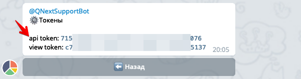

## @HowUsedBot - API

[⬅️ @HowUsedBot - Документация](/docs-test/howusedbot)


После регистрации в меню вашего бота в разделе ⚙️ `Токены` вы можете увидеть два токена: view-токен и api-токен.




Все api запросы отправляются по ссылке:
```js 
https://qnext.app/bin/webhooks/6438/181/4opQGmB6OlHqqPRM
```

Все запрос в api должны обязательно содержать три **body** параметра:
* **botId** - id вашего бота
* **apiToken** - api токен который вам показал бот @HowUsedBot при регистрации.
* **requestType** - тип запроса (для обратной совместимости со старой версией api - не обязательный, по умолчанию **update**).

В зависимости от значения **requestType** могут быть дополнительные параметры. Параметр **requestType** может принимать следующие значения:
* [requestType: event](#requesttype:-event)
* [requestType: getOnline](#requesttype:-getonline)
### requestType: event

Сохранить событие, наступившее в вашем боте.
### Пример запроса:
```js 
{
    "botId": 1234567,
    "apiToken": "you-api-token",
    "requestType": "event",
    "event": "myEventName",
    "userId": 7654321,
    "userRegisterTime": "unixtimestamp"
}
```
* **event** - имя события, любая строка длиной от 3 до 20 символов.
* **userId** - числовой айди юзера
* **userRegisterTime** - unixtimestamp дата регистрации пользователя. <u>Не обязательный</u>. Если не передать, используется текущая дата в момент первого события от этого пользователя. Используйте этот параметр если пользователь уже давно пользуется вашим ботом, чтобы HowUsedBot знал когда этот пользователь был зарегистрирован в вашем боте. Если вы забыли  прислать дату регистрации, и HowUsedBot уже записал текущую дату - не страшно, при следующем запрос от этого пользователя, если вы пришлете дату регистрации - дата будет обновлена.
* **param_1** - дополнительный параметр запроса
* **param_2** - дополнительный параметр запроса
* **param_3** - дополнительный параметр запроса

Дополнительные параметры запроса(param_1, param_2 и param_3) можно использовать для сегментации событий. Например если вам необходимо в событии **register**, узнать разброс пользователей по языкам, передайте например в параметре **param_1** значение языка пользователя. После этого вы сможете построить график с фильтром или сегментацией по значению языка пользователей.
### Ответ:
```js 
{
   "ok": true
}
```


Примеры запросов на разных языках:
* [python](/docs-test/howusedbot/api-python)
* [NodeJS](/docs-test/howusedbot/api-nodejs)
### requestType: getOnline

Получить количество пользователей online - это те пользователи которые обращались к боту за последние N секунд. Пример запроса:
```js 
{
    "botId": 1234567,
    "apiToken": "you-api-token",
    "requestType": "getOnline",
    "seconds": 300
}
```

Параметр seconds не обязательный, по умолчанию 120. Можно передать значение до 600 секунд.
### Ответ:
```js 
{
    "ok": true,
    "onlineCount": 1
}
```


### requestType: update

⛔️Устаревая конструкция, используйте [requestType: event](#requesttype:-event) ⛔️

 Как перенести старые записи в новую таблицу читайте в [FAQ](/docs-test/howusedbot/faq).


[⬅️ @HowUsedBot - Документация](/docs-test/howusedbot)


  

