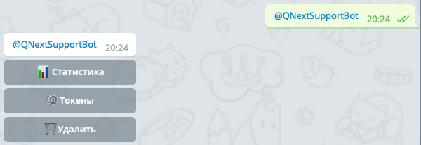
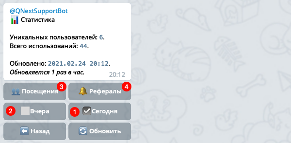

[⬅️ @HowUsedBot - Документация](/docs-test/howusedbot)


Часто задаваемые вопросы по боту [@HowUsedBot](http://t.me/HowUsedBot)
 * - [Как мне посмотреть статистику своего бота?](/docs-test/howusedbot)
 * - [Какую стату можно увидеть?](/docs-test/howusedbot)
 * - [Я удалил бота, как мне восстановить статистику?](/docs-test/howusedbot)
 * - [Как мне увидеть события с определенным параметром event?](#как-мне-увидеть-события-с-определенным-параметром-event?)
 * - [Как перенести старые события в новую таблицу?](#как-перенести-старые-события-в-новую-таблицу?)
 * - [Какие есть ограничения?](/docs-test/howusedbot)
 * - [Как на счет оплаты?](/docs-test/howusedbot)
 * - [У меня еще остались вопросы](/docs-test/howusedbot)


## Как мне посмотреть статистику своего бота?

Если вы уже подключили своего бота, просто пришлите боту [@HowUsedBot](http://t.me/HowUsedBot) юзернейм вашего бота в формате `@username` и вы увидите меню главное меню вашего бота:



Откройте раздел 📊Статистика, там вы увидите сжатую стату за сегодня(1️⃣) или вчера(2️⃣), а так же ссылки для просмотра количества посещений(3️⃣) и использования реферальных ссылок(4️⃣) за любой период:



Какую стату можно увидеть?
* Общее количество обращений к боту в личке (_кнопка 👥 Посещения_)
* Количество уникальных пользователей использовавших бота в личке(_кнопка 👥 Посещения_)
* Количество использованных реферальных ссылок, т.е. что открываются командой `/start ref_id`. (_кнопка 🔔 Рефералы_)
## Я удалил бота, как мне восстановить статистику?

К сожалению это не возможно, после удаления бота вся статистика удаляется безвозвратно. 
## Как мне увидеть события с определенным параметром event?

Откройте ссылку просмотра событий вместе с параметром `event=MyEventName`. Например: 
```js 
https://qnext.app/bin/charts/6438/19/678cf4eb1efb80c5669b1f3b443d38850d4d642f?token=08b0c15b-5407-442c-aa7f-36ecd7032533&id=973767196&event=MyEventName
```

Вы можете в параметр event передать несколько ивентов, разделенных запятой:
```js 
&event=MyEventName1,MyEventName1,MyEventName3
```
## Как перенести старые события в новую таблицу?

Запросы вида requestType: update признаны устаревшими, необходимо использовать новый запрос requestType: event. С новым запросов, статистика записывается в новую таблицу. Т.е. та статистика которая была таблице updates не попадает в таблицу event.  Но вы можете воспользоваться командой миграции, чтобы перенести все события из таблицы update в event. Для этого в личке с ботом напишите команду:
```js 
!migration YourBotId YourEventName
```

где:
* YourBotId - числовой id вашего бота
* YourEventName - название вашего события, можете написать любую строку от 3 до 50 символов.

Например так:
```js 
!migration 1234567 old_updates
```


## Какие есть ограничения?

На текущий момент ограничение одно - статистика обновляется 1 раз в час. Если вы хотите видеть статистику в реалтайме, напишите об этом в [чате тех. поддержки](https://t.me/joinchat/keNZx-X9Nqw3YzA6).
## Как на счет оплаты?

На данный момент использование бота бесплатное. Если ваш бот будет генерировать тонны сообщений в секунду - возможно для вас бот будет платным.
## У меня еще остались вопросы

Добро пожаловать в [чат тех. поддержки](https://t.me/joinchat/keNZx-X9Nqw3YzA6).


[⬅️ @HowUsedBot - Документация](/docs-test/howusedbot)


  

