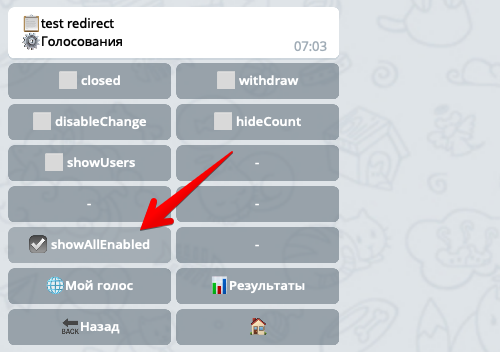

## QNext. Макрос vote

Макрос `!{vote}` используется для работы с голосами опроса. Макрос умет выводить результаты голосования в разных форматах, в зависимости от параметра `type`.

Если макрос вставить в текст контента с кнопками, тогда макрос будет применяться к текущему контенту и кнопке(кнопка та, на которую нажал пользователь). Вы можете изменить это поведение, если явно укажите ссылку на контент и кнопку, для этого используются параметры: `contentId` и `buttonId`.


Параметр `type` может принимать одно из значений:
* [type: results](#type:-results) - Результаты голосования
* [type: users](#type:-users) - [Имена проголосовавших](#type:-users)
* [type: count](#type:-count-и-type:-weight) - Количество проголосовавших
* [weight](#type:-count-и-type:-weight) - Сумма весов всех голосов
* [type: my](#type:-my) - Ссылка на выбор пользователя
* [type: all](#type:-all) - Ссылка на выбор всех пользователей
* [type: user](#type:-user) - Показать название кнопки, за которую проголосовал пользователь
* [type: userList](#type:-userlist) - Показать юзеров из списка пользователей


### type: results

С типом `type: results` макрос сформирует полные результаты голосования. Бот пройдет по всем кнопкам, найдет количество голосов за каждую кнопку и отобразит результаты для каждой кнопки на новой строке в формате:

`<количество> - <название кнопки>`
### Список параметров
* `template` - шаблон вывода
* `splitter` - разделитель, по умолчанию переход на новую строку
* `showEmpty` - Показывать кнопки, за которые не голосовали. Параметр не имеет значения, достаточно его просто вставить в макрос без значения: `showEmpty;`
* `maxCount` - сколько максимум голосов загрузить
* profileId - ID профиля юзера

Если вы хотите изменить формат вывода, например чтобы сначала отображалось название кнопки, а потом количество в скобках, тогда в макрос необходимо добавить параметр template:
```js 
!{vote|
 type:results;
 template: $title ($count);
}
```

Как видите, в параметре `template` мы использовали два вложенных параметра `$title` - название кнопки и `$count` - количество голосов.
### Параметры шаблона template:
* `$title` - Название кнопки
* `$description` - Описание кнопки
* `$count` - Количество голосов за эту кнопку
* `$percent` - Количество голосов за эту кнопку в процентах
* `$index` - Порядковый номер кнопки, начиная 1
* `$users` - Имена со ссылками всех проголосовавших пользователей.
* `$profileSum` - Сумма значений профилей пользователей 

⚠️Если в шаблоне `template` указать параметр `$users`, тогда в макросе можно использовать параметры из макроса [type: users](#type:-users).

⚠️Если в шаблоне `template` указать параметр `$profileSum`, тогда в макросе также требуется указать параметр `profileId: ID`.


### type: users

Макрос с типом `type: users` покажет имена проголосовавших. 

Доступные параметры:
* `buttons` - Список 🆔кнопок, через запятую. Будут показаны имена проголосовавших за эти кнопки. По умолчанию все кнопки.
* `splitterUser` - разделитель между пользователями
* `splitterButton` - разделитель между кнопками, если в параметр buttons указано больше 1 кнопки или если buttons вовсе не указать
* `userPrefix` - приставка к каждому пользователю, можно например указать иконку 👤
* `userView` - режим отображения пользователя
* `userLink` - ссылка на пользователя
* `userTemplate` - строка шаблон, для отображения пользователя
* `maxCount` - сколько максимум голосов загрузить
* profileId - ID профиля юзера
### Список значений userView
* `username` - отображается только @username пользователя
* `name` - отображается только Имя пользователя
* Если не указать ничего, тогда показывает Имя + @username. если есть
### Список значений userLink
* `none` - Без ссылки, необходимо использовать для реакций alert и notification, т.к. в этом окне ссылки не работают.
* `admin` - Администраторская ссылка на пользователя, чтобы увидеть подробности пользователя. Ссылка доступна только админам бота.
* Если не указать, используется прямая ссылка на пользователя
### Формат шаблона userTemplate

Шаблон, это строка которая будет применена к каждому пользователю перед отображением. Например если в качестве шаблона указать строку

`$index - $user ( $userId )`

тогда на выходе вы получите такой вывод:
```js 
1 - ИмяПользователь1 ( idПользователя1 )
2 - ИмяПользователь2 ( idПользователя2 )
...
```

Если параметр `userTemplate` не указать, отображается просто список имен пользователей. В этом шаблоне доступны следующие параметры:
* $index - номер юзера
* $user - имя юзера и username если есть
* $name - имя юзера
* $username - логин юзера
* $profile - значение профиля юзера


### type: count и type: weight

Показывает количество голосов(**count**) и сумму весов всех голосов(**weight**). У каждой кнопки можно задать свой вес, и эти значения будут суммироваться в макросе `type: weight`.

Макросы могут принимать следующие параметры:
* `where` - где брать количество и сумму
* `percent` - показывать в процентах, параметр не имеет значения, можно просто написать `percent;` без знака равенства.

Параметр `where` может принимать следующие значения:
* all - все голоса
* buttons - определенные кнопки(кнопка)

Если указать для параметр `where` значение `buttons`, тогда необходимо указать дополнительный параметр `buttons`, в котором необходимо через запятую указать список тех кнопок, по которым необходимо посчитать сумму:
```js 
!{vote| 
  type: count;
  where: buttons;
  buttons: 123,321,567
}
```


### type: my

Макрос покажет в теле контента ссылку, нажав на которую пользователь сможет увидеть за что он проголосовал в этом опросе.
```js 
!{vote|
  type: my;
}
```

По умолчанию ссылка показывается под текстом `"Мой голос"`, этот текст можно изменить указав параметр `title`:
```js 
!{vote|
  type: my;
  title: Посмотреть мой голос;
}
```


### type: all

Макрос покажет в теле контента ссылку, нажав на которую пользователь сможет увидеть за что проголосовали другие пользователи:
```js 
!{vote|
  type: all;
}
```

По умолчанию ссылка показывается под текстом `"Все голоса"`, этот текст можно изменить указав параметр `allTitle`:
```js 
!{vote|
  type: all;
  allTitle: Посмотреть все голоса;
}
```

Показ всех голосов работает только в том случае, если вы в настройках своего опроса включили галочку `showAllEnabled`:



Если указать дополнительно параметр count, тогда макрос не покажет ничего, если общее количество голосов меньше значения count. Если вы хотите в этом случае все же показать какой то пояснительный текст, тогда можно дописать необязательный параметр fewTitle:
```js 
!{vote|
  type: all;
  count: 10;
  fewTitle: Голосов меньше 10;
}
```


### type: user

Макрос покажет название кнопки, за которую проголосовал пользователь:
```js 
!{vote|
  type: user;
}
```

По умолчанию макрос покажет информацию по текущему пользователю, вы можете указать какого именно пользователя необходимо отобразить передав в макрос параметр `userId`:
```js 
!{vote|
  type: user;
  userId: 123;
}
```

Если пользователь не голосовал, макрос по умолчанию покажет текст `"Нет голосов"`, вы можете изменить этот текст указав параметр `notFound`:
```js 
!{vote|
  type: user;
  userId: 123;
  notFound: Пользователь еще не голосовал;
}
```


### type: userList

Макрос покажет всех юзеров из списка пользователей и покажет проголосовал пользователь или нет. Макрос загружает максимум 200 первых пользователей из списка. У макроса есть множество разных параметров.
* filter - фильтрация пользователей. 
* sort - сортировка пользователей
* sortDirection - направление сортировки
* usersListId - id списка пользователей
* splitterUser - разделитель пользователей, по умолчанию переход на новую строку
* votedTemplate - шаблон для проголосовавших
* notVotedTemplate - шаблон для не проголосовавших
* dateFormat - формат вывода даты
* profileId - id профиля который необходимо показать вместе с юзером
* profileNotFound - текст по умолчанию если нету профиля. 


🔸**filter** может принимать одно из значений:
* voted - показывать только проголосовавших
* notVotes - показывать только НЕ проголосовавших

🔸**sort** может принимать одно из значений:
* vote - сортировать по дате голосования
* listMember - сортировать по дате добавления в список

🔸**sortDirection** может принимать одно из значений:
* direct - прямая сортировка, значение по умолчанию. 
* reverse - обратная сортировка

🔸**dateFormat** может формат выводимой даты, подробности в описании макроса [!{date}](/docs-test/macros/date).

**Шаблоны**

🔸**votedTemplate** - это строка-шаблон, в которой можно указать каким образом отображать проголосовавших пользователей. Значение по умолчанию:
```js 
✅$user - $title
```

Эта строка означает что для каждого проголосовавшего пользователя будет применен этот шаблон, и в строке параметры $user и $title будут заменены на соответствующие значения. В шаблоне можно использовать следующие параметры:
* $user - имя юзера
* $title - название кнопки
* $description - описание кнопки
* $profile - значение профиля
* $createdAt - дата первого голосования
* $updatedAt - дата последнего изменения голоса

🔸**notVotedTemplate** - шаблон для не проголосовавших пользователей, работает аналогично **votedTemplate**, только имеет следующее значение по умолчанию:
```js 
🚫$user
```


[⬅️QNext. Макросы](/docs-test/macros)
  
[Original](https://telegra.ph/QNext-Macros-Vote-12-23)
