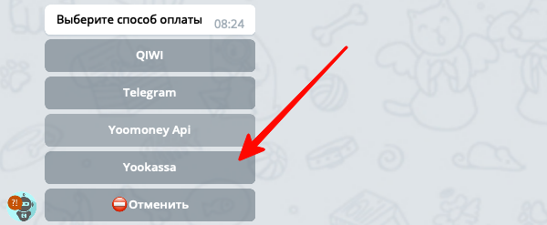
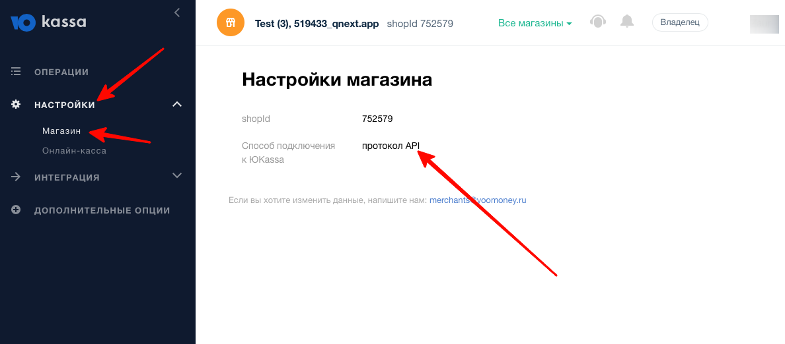
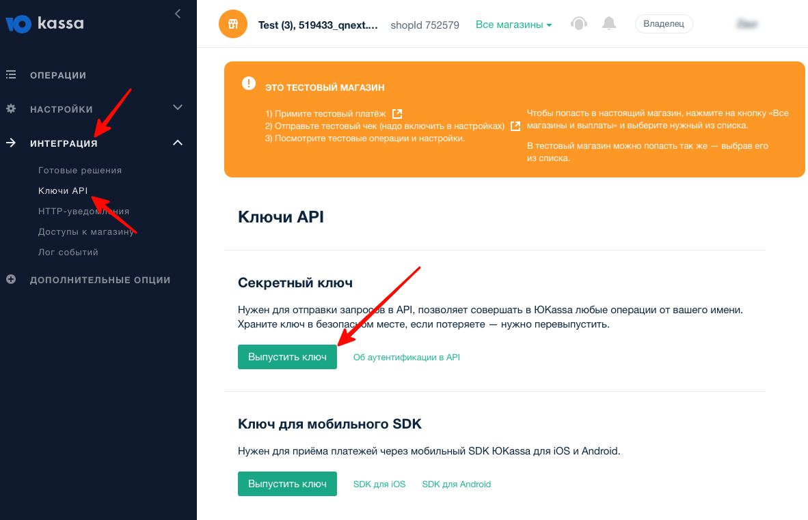
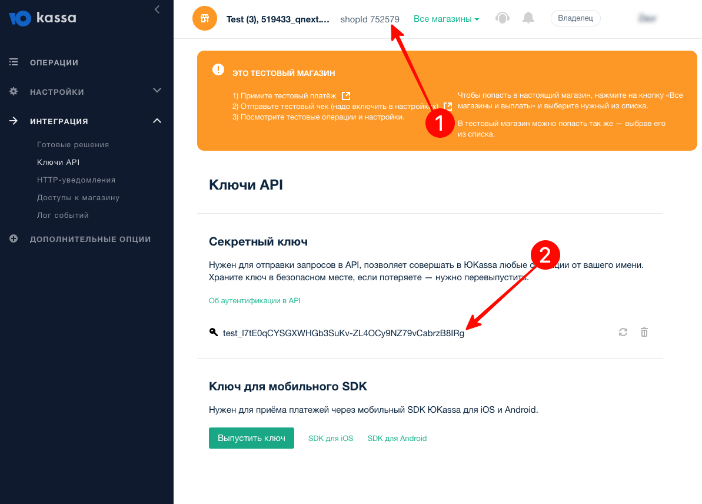

* [Подключение](#подключение)
* [Как получить shopId и секретный ключ?](#как-получить-shopid-и-секретный-ключ?)
* [Тестирование](#тестирование)
### Подключение

1) Войдите в раздел `💰Платежи->Способы` оплаты из главного меню вашего бота, нажмите кнопку `➕Добавить`, после чего выберите способ **Yookassa**:

2) Далее бот попросит ввести название бота, shopId и секретный ключ.
### Как получить shopId и секретный ключ?

Зарегистрируйтесь на сайте [https://yookassa.ru](https://yookassa.ru/), создайте магазин. ЮКасса предлагает несколько разных протоколов работы магазина, вам необходимо создать магазин который будет работать по протоколу API. У ЮКассы есть некоторые требования для получения API. Чтобы проверить что вы создали правильный магазин, откройте раздел `Настройки - Магазин` и убедитесь что в поле `Способ подключения` `указано протокол API`:

Откройте раздел `Интеграция - Ключи API` и нажмите кнопку `Выпустить ключ`: 

После выпуска скопируйте shopId и полученный ключ:

### Тестирование

Вы можете создать в ЮКассе тестовый магазин. При использовании тестового магазина, используйте тестовые карты для оплаты, например
::: tip
5555 5555 5555 4444 11/22           333 
:::

Подробнее про тестирование ЮКассы можно почитать здесь [https://yookassa.ru/developers/using-api/testing](https://yookassa.ru/developers/using-api/testing) .

[⬅️QNext. Платежи](/docs-test/ph/QNext-Payments-12-14)

