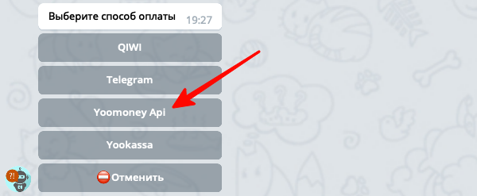
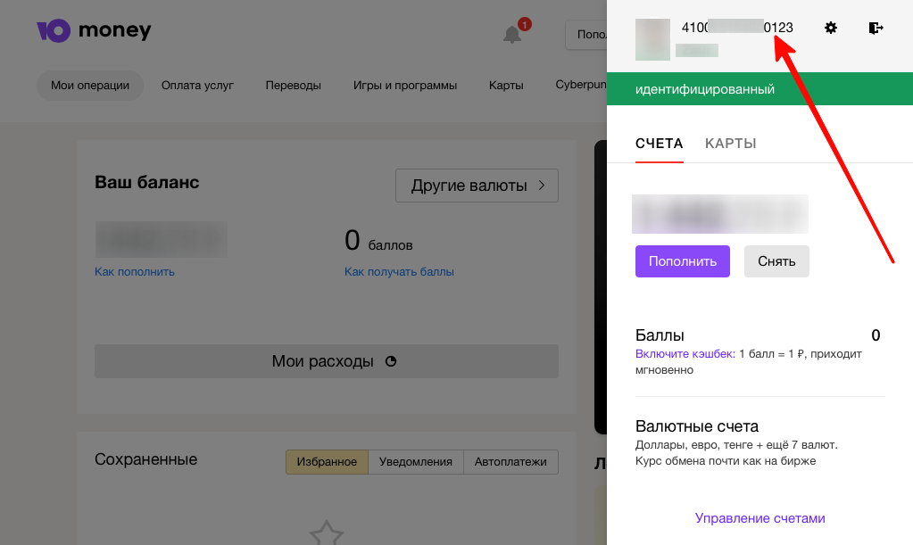
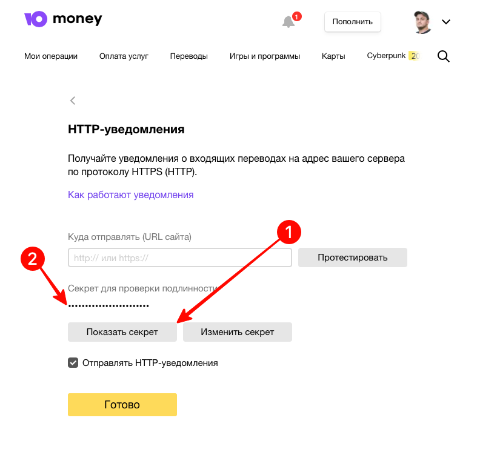
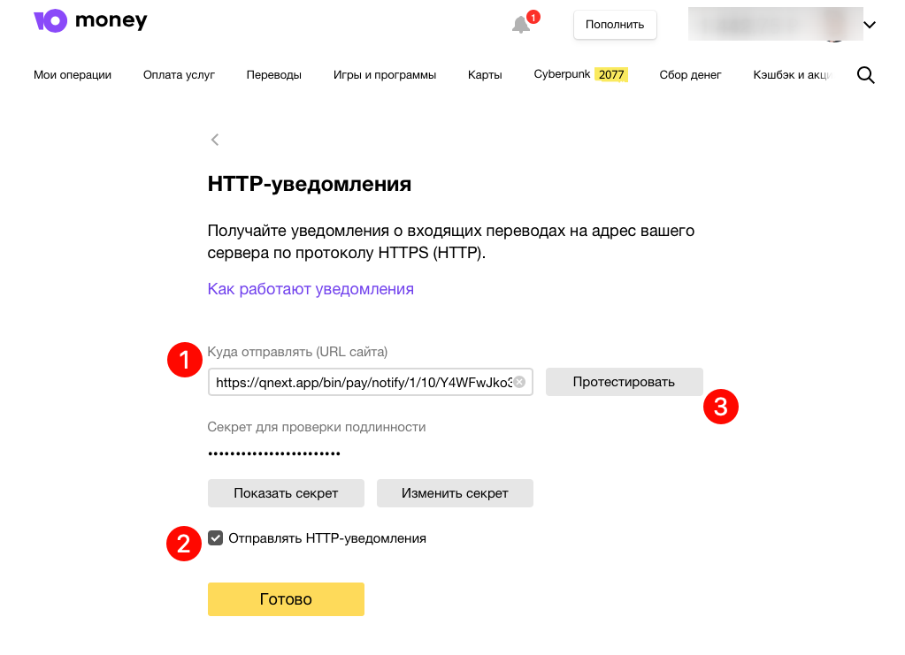
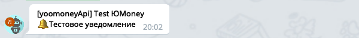
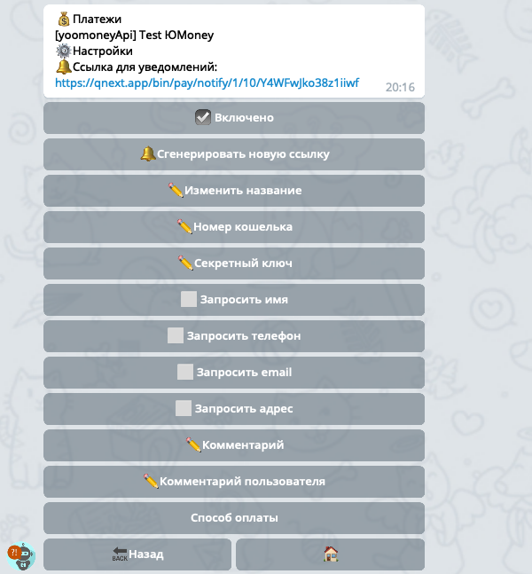
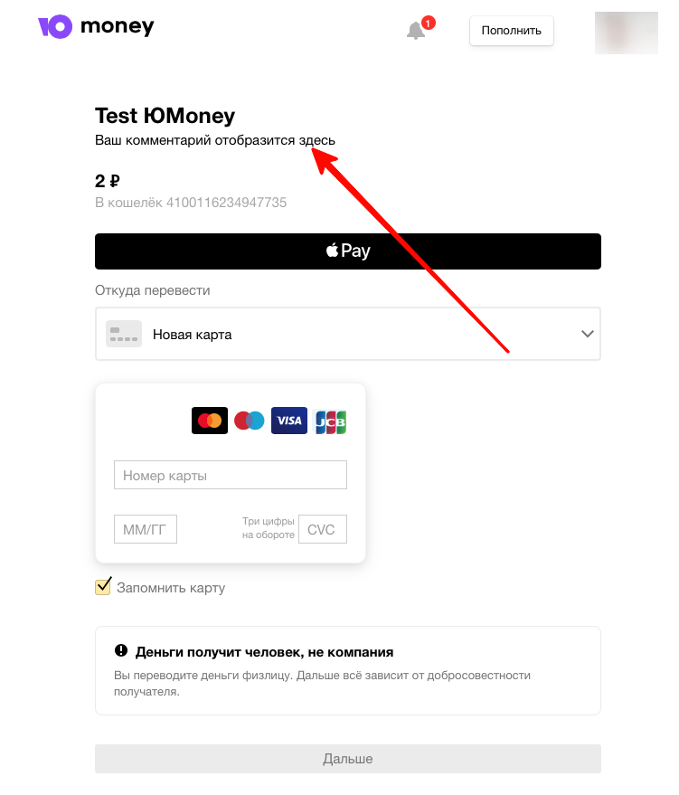

QNext. Прием платежей с помощью ЮMoney кошелька
* [Подключение](#подключение)
* [Как получить секретный ключ?](#как-получить-секретный-ключ?)
  * -  [Настройка уведомлений](#настройка-уведомлений)
* [Настройки](#настройки)

### Подключение

1) Войдите в раздел `💰Платежи->Способы` оплаты из главного меню вашего бота, нажмите кнопку `➕Добавить`, после чего выберите способ **Yoomoney Api**:

2) Дальше бот попросит указать номер вашего ЮMoney кошелька. Получить номер можно в личном кабинете кошелька:

3) На следующем шаге бот попросит прислать **Секретный ключ** из личного кабинета ЮMoney кошелька.
### Как получить секретный ключ?

Получить секретный ключ можно на странице:

[https://yoomoney.ru/transfer/myservices/http-notification](https://yoomoney.ru/transfer/myservices/http-notification)

Нажмите кнопку **Показать секрет**, и скопируйте полученную строку:

### Настройка уведомлений

Чтобы ваш бот получал от ЮMoney информацию о том, что кто то завершил оплату, необходимо настроить уведомления. Откройте раздел ⚙️Настройки вашего способа оплаты и скопируйте `🔔Ссылку для уведомлений`. Эту ссылку необходимо вставить в поле для http уведомлений на странице:

[https://yoomoney.ru/transfer/myservices/http-notification](https://yoomoney.ru/transfer/myservices/http-notification)

Не забудьте включить галочку `☑️ Отправлять HTTP-уведомления`. После этого можно нажать на кнопку Протестировать, и если вы все сделали правильно, ваш бот в телеграме покажет тестовое уведомление:

### Настройки

В разделе настройки созданного способа оплаты вы можете изменить следующие опции:

Если включить галочки ☑️Запросить имя, телефон email и адрес - тогда ЮMoney при оплате будет запрашивать соответствующую информацию у пользователя.

`✏️Комментарий` - здесь можно указать текст, который пользователь увидит на странице оплаты:

`✏️Комментарий пользователя` - этот текст, увидит ваш пользователь после оплаты, в своем личном кабинете в списке платежей.

[⬅️QNext. Платежи](/docs-test/ph/QNext-Payments-12-14)

