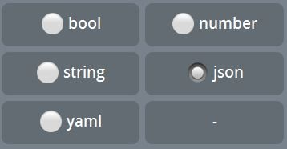

Глобальные переменные — переменные, которые позволяют хранить различные типы данных длительное время. Присваивать, изменять и удалять значения глобальных переменных можно в процессе работы триггера. Значение глобальной переменной доступны всем пользователям после ее загрузки реакцией: loadGlobalVariable и сохраняется до момента удаления переменной или ее значения.

Глобальные переменные можно создать в соответствующем разделе меню, указав следующие параметры:

 — **Название переменной** — Название глобальной переменной.

 — **Код переменной** — Код (имя) динамической переменной. Служит для идентификации переменной, при обращении к ней, для получения значения. Например: ${globalVar.varName} — формат обращения к переменной с кодом переменной: varName.

 — **Значение **— значение переменной, можно присвоить при создании или редактировании.

 — **Тип переменной** — необходимо указать тип значений переменной.

Предоставлены 5 типов:

* **bool **— логический тип данных, принимающий два возможных значения, называемых истиной (true) и ложью (false).
* **number **— числовые значения. Например: 123 или 567.89
* **string **— текстовые значения. Например: "апельсин" или " яблоко это не груша"
* **json **— формат для хранения и обмена данными, который хранит структурированную информацию и в основном используется для передачи данных между сервером и клиентом.
* **yaml **— формат данных, концептуально близкий к языкам разметки, но ориентированный на удобство ввода-вывода типичных структур данных многих языков программирования.

 * [**globalVarDel **](/ph/QNext-admin-reaction-globalVarDel-05-08)- Удалить глобальную переменную
 * [**globalVarSet **](/ph/QNext-admin-reaction-globalVarSet-05-08)- Сохранить глобальную переменную
 * [**loadGlobalVar **](/ph/QNext-admin-reaction-loadGlobalVariable-05-08)- Загрузить глобальные переменные

**Особенности:**

— 15к символов на одну глобальную переменную

[QNext. Каталог реакций](/ph/QNext-admin-reaction-about-05-01)