🕹 **Меню **— элемент интерфейса пользователя, позволяющий выбрать одну из нескольких перечисленных опций бота.
* [Создание](#создание)
* [Настройка](#настройка)
* [Ограничения](#ограничения)
* [Кнопки навигации](#кнопки-навигации)
* [Настройки раздела](#настройки-раздела)
* [Добавить кнопку](#добавить-кнопку)
* [Триггеры](#триггеры)

Рассмотрим создание меню и его особенности:
#### Создание
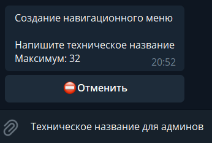

**Техническое название** — название которое будут видеть только админы бота (пользователям оно недоступно)
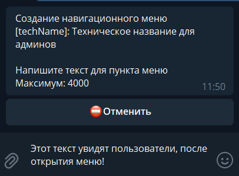

**Текст для пункта меню** — текст который увидят пользователи, когда откроют это меню.

_Готово, основа создана!_
#### Настройка
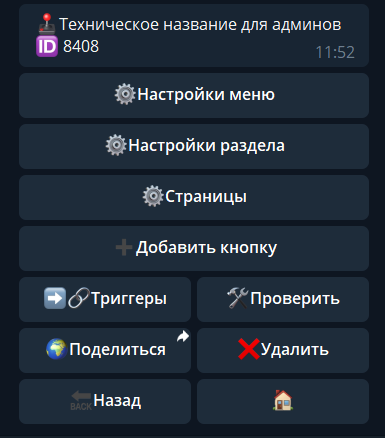
* [**Настройки меню**](#настройки-меню)
* [**Настройки раздела**](#настройки-раздела)
* [**Страницы**](#страницы)
* [**Добавить кнопку**](#добавить-кнопку)
* [**Триггеры**](#триггеры)

#### Настройки меню
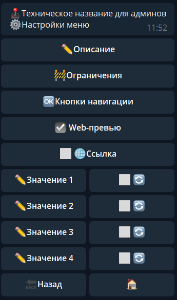
* [Описание](#описание)
* [Ограничения](#ограничения)
* [Кнопки навигации](#кнопки-навигации)
* [Web-превью](#web-превью)
* [Значения](#значения)
::: tip
[_Вернуться к разделу: Настройка_](#настройка)
:::
#### Описание

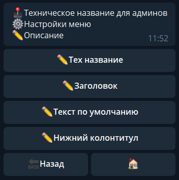
* **Тех название **—** **название видимое для администратора.
* **Заголовок **—** ** указанный текст будет присутствовать на всех страницах меню, в верхней части сообщения.
* **Текст по умолчанию **—** **Вы можете задать стандартный текст внутри кнопки. Это не текст на кнопке, но внутри неё - подобно тому, который Вы сейчас читаете. Если при создании кнопки Вы пропустите этот шаг, то текстом кнопки автоматически будет текст по умолчанию.
* **Нижний колонтитул **—** **указанный текст будет присутствовать на всех страницах меню, в нижней части сообщения.
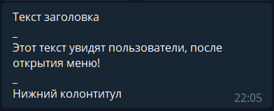
::: tip
[Вернуться к разделу:  **Настройка**](#настройка)
:::
#### Ограничения

Здесь настраиваются глобальные ограничения всего раздела меню.
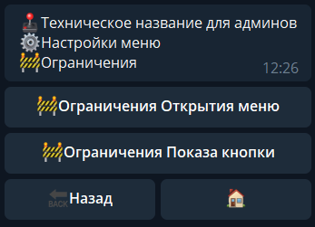
* **Ограничения Открытия меню** — позволяет ограничить доступ к разделу меню. Это глобальное ограничение, которое будет распространяться на все подразделы.
* **Ограничения Показа кнопка** — позволяет ограничить видимость кнопки меню. Это глобальное ограничение, которое будет распространяться на все подразделы.
::: tip
[Вернуться к разделу:  **Настройка**](#настройка)
:::
#### Кнопки навигации

Кнопки навигации, для более удобного и быстрого перемещения пользователя в вашем меню.

💢Скрыть — скрыть (удалить) открытое меню, по умолчанию значок: 💢

🔙Назад — позволяет переместить на страницу (раздел) назад, по умолчанию значок: 🔙 

 🏠Домой — позволяет переместить в главное (корневое) меню, по умолчанию значок: 🏠
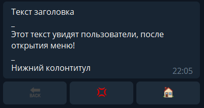
::: tip
[Вернуться к разделу:  **Настройка**](#настройка)
:::
#### Web-превью

Отключает превью ссылок в разделе.

- Если отключаете превью в главном разделе — отключается превью во всех вложенных разделах.

- Если отключаете превью в вложенных разделах — это касается только этого раздела.

!! Если выключить ссылку — полученные ранее ссылки больше не будут работать. !!
::: tip
[Вернуться к разделу:  **Настройка**](#настройка)
:::
#### Значения

Значения позволяют хранить цифровые параметры при отправке публикации меню в чат.
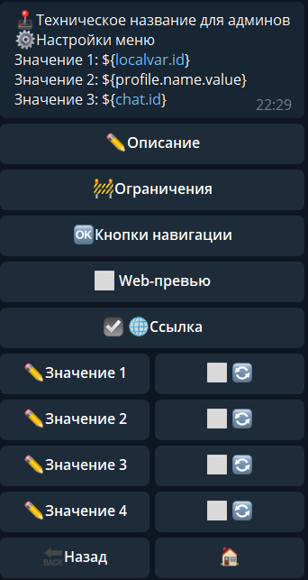

Например в значения профиля можно записать: 
* ID инициатора, 
* параметр профиля,  
* ID чата.

Важно: 

По умолчанию, все значения хранятся только в рамках одного меню (одной публикации). Переход между страницами не сохраняет эти значения.

Галочка 🔄 справа от значения, позволяет сохранить значения во всех подразделах меню.

Важный момент! Все значения формируются до отправки сообщения в чат.

Они статичны и не подлежат изменению (или формированию до отправления)

Получить доступ к этим значениям можно с помощью переменных:
${buttonsVar.v1} - ${user.id}

${buttonsVar.v2} - ${profile.name.value}

${buttonsVar.v3} - ${chat.id}

${buttonsVar.v4}
::: tip
[Вернуться к разделу:  **Настройка**](#настройка)
:::

#### Настройки раздела
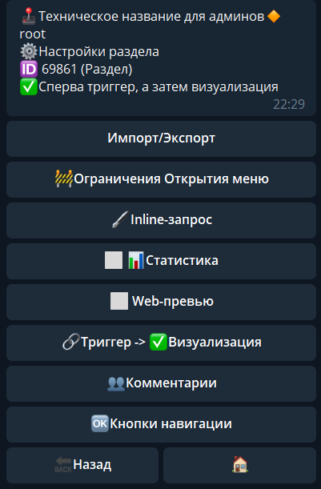
* [**Импорт/Экспорт**](#импорт/экспорт)
* [**Ограничения открытия меню**](#ограничения-открытия-меню)
* [**inline-запрос**](#inline-запрос)
* [**Статистика**](#статистика)
* [**web-превью**](#web-превью)
* [**Триггер -> Визуализация**](#триггер-->-визуализация)
* [**Комментарии**](#комментарии)
* [**Кнопки навигации**](#кнопки-навигации)
* [**Динамическое меню**](#динамическое-меню)

#### Импорт/Экспорт

_(в разработке)._ 

В дальнейшем функция позволит полностью переносить разделы меню как в рамках одного бота, так и между ботами. 
#### Ограничения открытия меню

Позволяет ограничить доступ к разделу меню. Это локальное ограничение, которое будет распространяться только на этот раздел (подраздел).
#### inline-запрос

Позволяет настроить inline — запрос на вызов этого меню.
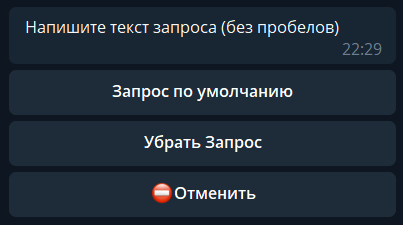
#### 
#### Статистика

Позволяет вести статистку по активности раздела. 

[Пример](https://qnext.app/stats/5622/bPQ2LHSLFUIge8Mm/menu/8408)
#### Web-превью

Отключает превью ссылок в разделе.

- Если отключаете превью в главном разделе — отключается превью во всех вложенных разделах.

- Если отключаете превью в вложенных разделах — это касается только этого раздела.
#### Триггер -> Визуализация

Очень важная функция. 

**Триггер -> Визуализация**
* Если вы используете реакции связанные с загрузкой данных, скриптами, или другими процессами, которые занимают время, то рекомендуется выбрать порядок

В таком случае, скорость публикации меню будет ниже, бот сначала загрузит все необходимые данные, выполнит скрипты, а уже потом отправит меню, в связи с чем, возможны задержки.
* Если же у вас в меню вся информация статична, и не требуется подготовки перед отображением информации, то рекомендуется выбрать порядок

В таком случае скорость отклика будет быстрее, так как не будет происходить подготовки меню перед отправкой.
#### Комментарии

Эта опция является экспериментальной.

И для её работы используется бот @CommentsBot, который в свою очередь показывает рекламу на странице с комментариями.
#### Кнопки навигации

_В разработке_
#### Динамическое меню

Динамическое меню - это меню, которое может подстраивать в процессе работы. Т.е. вы не создаете заранее кнопки которые будут отображаться в этом разделе меню. Вы с помощью переменной указываете в Триггере Раздела какие кнопки должны быть в этом разделе. Откройте настройки раздела и нажмите на кнопку ✏️Динамическое меню, в ответ бот попросит написать путь до переменной, напишите например `${localVar.menuData}`. Теперь в Триггер Раздела, создайте локальную переменную `menuData` следующего содержания:
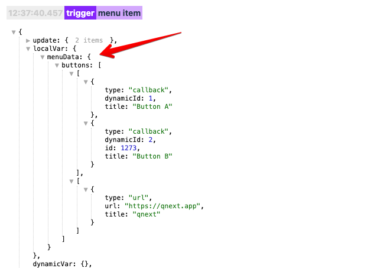

Получить такой объект можно например с помощью **JSON** строки:
::: tip
{  "buttons": [[{     "type": "callback",     "dynamicId": 1,     "title": "Button A"    }, {     "type": "callback",     "dynamicId": 2,     "id": 1273,     "title": "Button B"    }], [{     "type": "url",     "url": "https://qnext.app",     "title": "qnext"    }]   ] } 
:::

Валидировать и посмотреть JSON строку можно на сайте [https://jsonformatter.org/json-viewer](https://jsonformatter.org/json-viewer).

Или с помощью **YAML** строки:
::: tip
buttons:   -      - type: callback       dynamicId: 1       title: Button A     - type: callback       dynamicId: 2       title: Button B   -      - type: url       title: open url       url: https://qnext.app 
:::

Валидировать и посмотреть YAML строку можно на сайте [https://jsonformatter.org/yaml-viewer](https://jsonformatter.org/yaml-viewer).

И вы получите меню следующего вида:
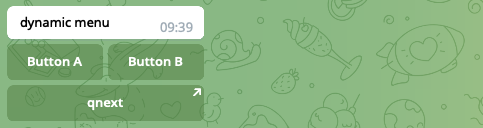

Объекте menuData может содержать следующие параметры:
* buttons - массив массивов кнопок.
* openItemId - id раздела который необходимо открыть. Чтобы открыть базовый раздел, укажите строку root.
* breakUpdate - не показывать текущее меню, т.е. после выполнения, обновления раздела меню не произойдет.

Массив кнопок `buttons`, должен содержать объекты button с полями `title` и `type`. Поле type может принимать одно из значений:
* callback
* url
* inline
* login
* contact
* location

В зависимости от поля type должны так же присутствовать и другие поля. 

**type: callback**

В этом случае необходимо дополнительно передать следующие параметры:
* dynamicId - любой числовой идентификатор, который поможет идентифицировать кнопку, которую нажал пользователь. ⚠️Обязательно должен быть числом.
* id - здесь может быть ID раздела меню, который необходимо открыть, это может быть любой раздел текущего меню. Необязательный параметр, если не передать, откроется текущий раздел меню. ⚠️Обязательно должен быть числом.
* `buttonValue1, buttonValue2, buttonValue3, buttonValue4`: здесь можно передать 4 любых значений, которые будут вести себя как `кастомные Значения` в настройках меню. ⚠️Обязательно должен быть числом.

После нажатия на такую кнопку, параметр `dynamicId` будет доступен в триггере раздела в переменной `${body.dynamicId}`.

**type: url**

В этом случае  необходимо передать параметры :
* url - ссылка, которую пользователь откроет при нажатии на кнопку

**type: login**

В этом случае  необходимо передать параметры :
* url - ссылка, на которую будет отправлена авторизационная информация

#### 
#### Страницы

**Новая страница**

🖼 - Создание страницы с медиа и текстом
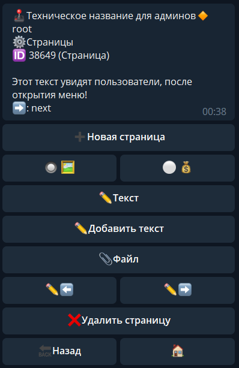

✏️Текст — отредактировать текст, в том числе и полностью удалить.

✏️Добавить текст — позволяет дополнить имеющийся текст, удалить его нельзя (удобная функция для админ меню)

📎Файл — Прикрепить медиа (лимит Telegram — 2 ГБ)

✏️⬅️ - отредактировать название кнопки "назад", по умолчанию: ⬅️

✏️➡️ - отредактировать название кнопки "вперед", по умолчанию: ➡️
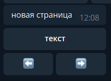

💰 - Создание страницы для оплаты
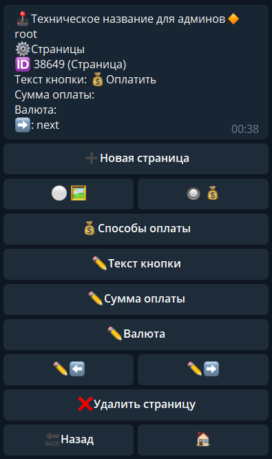

Интерфейс этого раздела полностью связан с настройками раздела: Платежи — платежные формы. Перед настройкой этого раздела, вам необходимо настроить разделы:
* Платежи — способ оплаты 
* Платежи — платежные формы.

Важный момент! На данный момент, доступно для выбора только способы оплаты Telegram.

#### Добавить кнопку
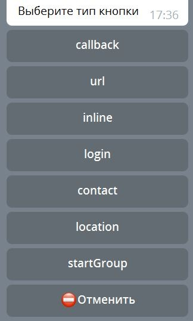

Типы кнопок:
* **callback **— вызов действия (отображения подраздела, или вызова триггеров)
* **url **— вставить ссылку для прямого открытия ресурса (не предусматривает использование реакций или счетчиков)

❗️ кнопка типа url работает только в меню! в клавиатуре ее нельзя вызвать ❗️
* **inline **— позволяет настроить inline — запрос на вызов различного контента
* **login **— подробнее [по ссылке](https://core.telegram.org/widgets/login)

❗️❗️ Из-за особенностей Телеграма, кнопки ниже, работают исключительно в клавиатуре. Через обычное меню их вызвать нельзя ❗️❗️
* **contact **— запросить у пользователя его контакт
* **location **— запросить у пользователя его геолокацию
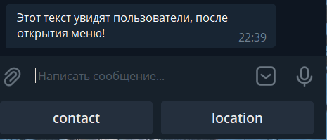

Ловить ответы можно через глобальный триггер ДО или После, или обычными командами с помощью регулярных выражений. Пример того как это выглядит в логах:

**Локация**
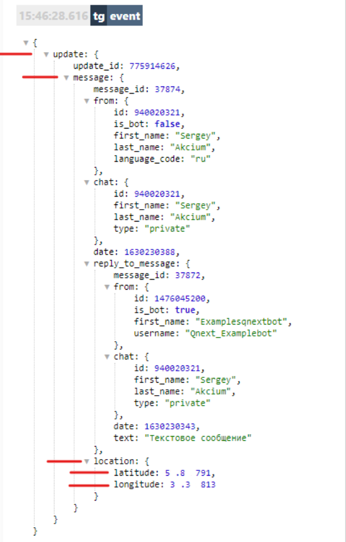

**Контакт**
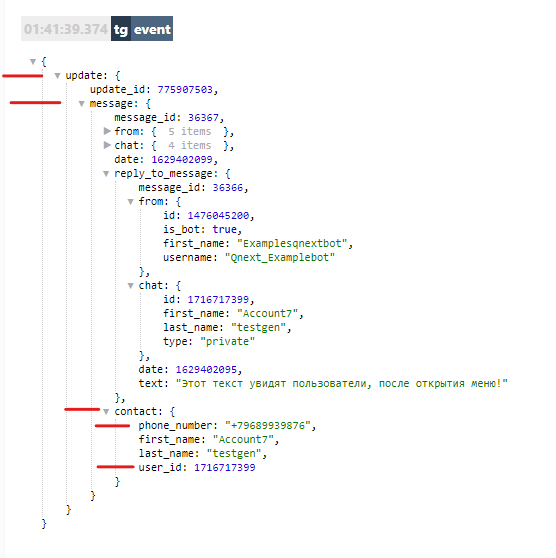
* **startGroup **— создание ссылки для выбора группы в которую хотите добавить бот.

#### Триггеры
* [Триггер Раздела](#триггер-раздела)
* [Триггер До](#триггер-до)
* [Триггер После](#триггер-после)
* [Триггер Назад](#триггер-назад)
* [Триггер Скрыть](#триггер-скрыть)
* [Триггер Домой](#триггер-домой)

#### Триггер Раздела

Срабатывает при любом действии
#### Триггер До

Срабатывает перед отображением меню
#### Триггер После

Срабатывает после совершения любого действия
#### Триггер Назад

Срабатывает при нажатии на кнопку Назад

Порядок действий других триггеров при нажатии на кнопку callback:
* Триггер Назад
* Триггер До
* Триггер Раздела
* Триггер После
#### Триггер Скрыть

Срабатывает при нажатии на кнопку Скрыть

Порядок действий других триггеров при нажатии на кнопку callback:
* Триггер Скрыть
#### Триггер Домой

Срабатывает при нажатии на кнопку Домой

Порядок действий других триггеров при нажатии на кнопку callback:
* Триггер Домой
* Триггер До
* Триггер Раздела
* Триггер После

[QNext. Документация](/ph/QNext-admin-documentation-05-08)

