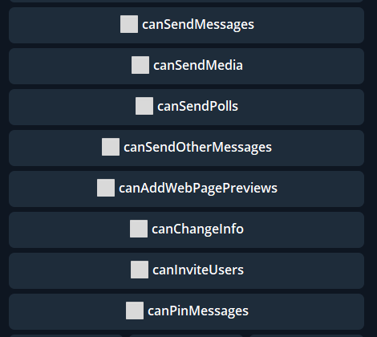

**chatPermissions **—** **Реакция для управления разрешениями чата.

**canSendMessages **— разрешение отправлять в чат сообщения

**canSendMedia **— разрешение отправлять в чат медиа (аудио, изображения, видео)

**canSendPolls **— разрешение создавать и публиковать в чате опросы

**canSendOtherMessages **— разрешение отправлять стикеры и GIF

**canAddWebPagePreviews **— разрешение отображать превью отправляемых ссылок

**canChangeInfo **— разрешение менять профиль группы

**canInviteUsers **— разрешение добавлять новых пользователей в группу

**canPinMessage **— разрешение закреплять сообщения в чате

[QNext. Чаты](/ph/QNext-admin-chat-about-07-05)

[QNext. Перечень реакции](/ph/QNext-admin-reaction-about-05-01)