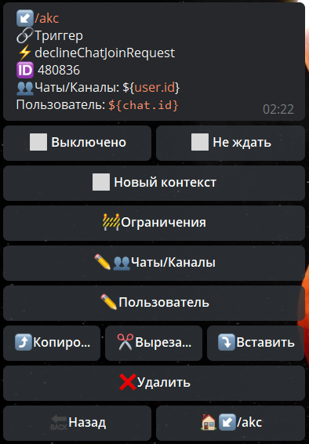

**declineChatJoinRequest **- отклонить запрос в чат.

Чаты/Каналы - указываем в каком чате необходимо отклонить заявку пользователя

Пользователь - указываем ID юзера, чью заявку необходимо отклонить.

[QNext. Чаты](/ph/QNext-admin-chat-about-07-05)

[QNext. Перечень реакции](/ph/QNext-admin-reaction-about-05-01)

