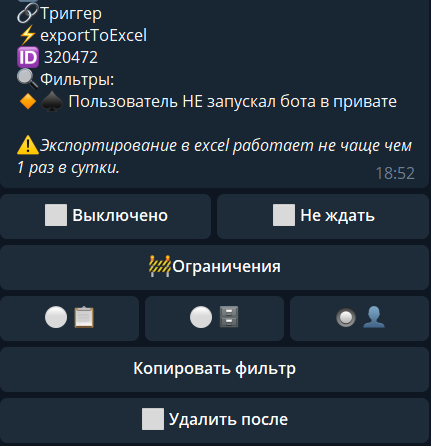
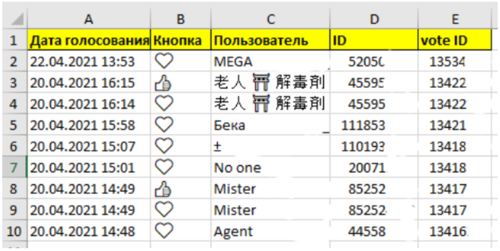
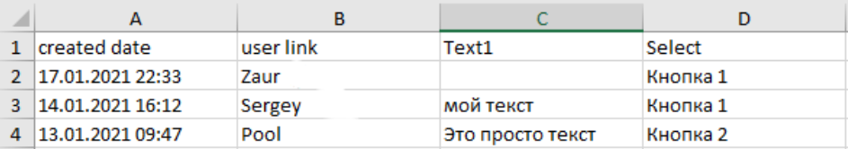

exportToExcel - позволяет экспортировать в Excel различные данные.

Реакция может использовать фильтры пользователей для экспорта, для этого необходимо выставить фильтры в разделе просмотра пользователей, а затем в реакции нажать на кнопку Копировать фильтр.

Реакция может экспортировать следующие типы данных:
* [**Голосование в контенте**](#голосование-в-контенте)
* [**Результаты формы**](#результаты-формы)
* [**Список пользователей бота**](#список-пользователей-бота)

**— После реакции exportToExcel, файл будет доступен в переменных.**

#### Голосование в контенте
* Переменная: **${exports.votes} **
* Макрос (файл): **!{attach| path: exports.votes} **

В файле нам будет доступно:

Дата голосования, кнопка за которую проголосовали, кто проголосовал, и уникальный ID нажатия на кнопку.

#### Результаты формы
* Переменная: **${exports.form}**
* Макрос (файл): **!{attach| path: exports.form}**

#### Список пользователей бота
* Переменная: **${exports.users}** (в разработке)
* Макрос (файл): **!{attach| path: exports.users} **(в разработке)

#### 
#### Особенности: 

⚠️На реакции имеются ограничения на частоту использования:

📋контент - 1 раз в час

🗄форма - 1 раз в час

👤Пользователи - 1 раз в сутки

*Относится не к сущности контента/формы/пользователей, то есть всего 1 контент/форма/список в час, а к определенному ID, т.е. один и тот же контент дважды выгрузить не получится, но несколько разных подряд выгрузить возможно.

Для облегчения процесса разработки, для админов бота ограничение уменьшено до 1 минуты. 

[QNext. Перечень реакции](/ph/QNext-admin-reaction-about-05-01)