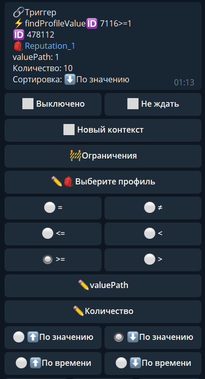
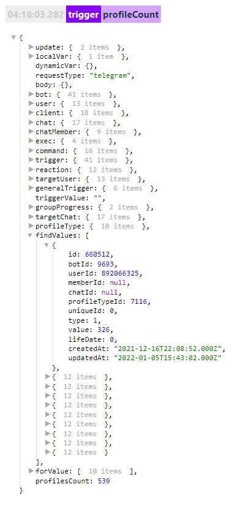

## QNext. реакция findProfileValue

**findProfileValue** - найдет все значения профиля, которые удовлетворяют заданным условиям поиска.

В настройках реакции можно указать сколько значений необходимо загрузить, и каким способом их отсортировать. Доступные следующие типы сортировок:

🔸 По значению

🔸 По времени создания

🔸 По времени жизни (если включено время жизни)

Нужный нам параметр можно найти в логах по пути:
${findValues...}

### ОСОБЕННОСТИ:

Загружает первых 200 человек, чей параметр совпадает условию.

[QNext. Профили](/docs-test/ph/QNext-admin-profile-about-04-25)

[QNext. Перечень реакции](/docs-test/ph/QNext-admin-reaction-about-05-01)

[QNext. Документация](/docs-test/ph/QNext-admin-documentation-05-08)