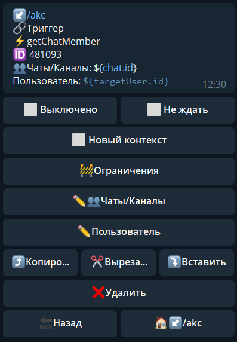
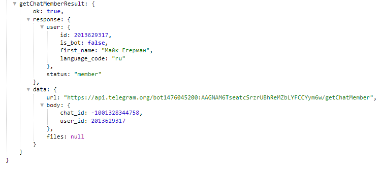

**getChatMember **- получить информацию об участнике чата

Чаты/Каналы - указываем чат в котором необходимо выполнить действие

Пользователь - указываем путь, по которому можно найти ID пользователя.

Информация будет доступна в переменной:

_${getchatMemberResult}_

::: tip
[**getChatMember method bot.api**](https://core.telegram.org/bots/api#getchatmember)
:::

[QNext. Чаты](/ph/QNext-admin-chat-about-07-05)

[QNext. Перечень реакции](/ph/QNext-admin-reaction-about-05-01)

