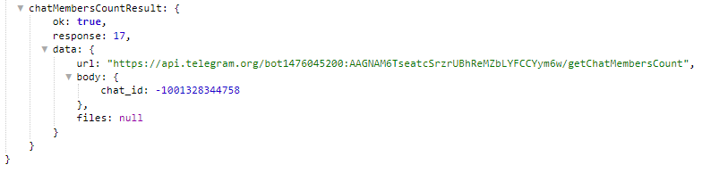

**getChatMemberCount **-получить количество участников в чате.

Чаты/Каналы - указываем чат в котором необходимо получить информацию.

Информация доступна в переменной: 
_${chatMembersCountResult}_

::: tip
[**getChatMemberCount method bot.api**](https://core.telegram.org/bots/api#getchatmember)
:::

[QNext. Чаты](/docs-test/ph/QNext-admin-chat-about-07-05)

[QNext. Перечень реакции](/docs-test/ph/QNext-admin-reaction-about-05-01)

