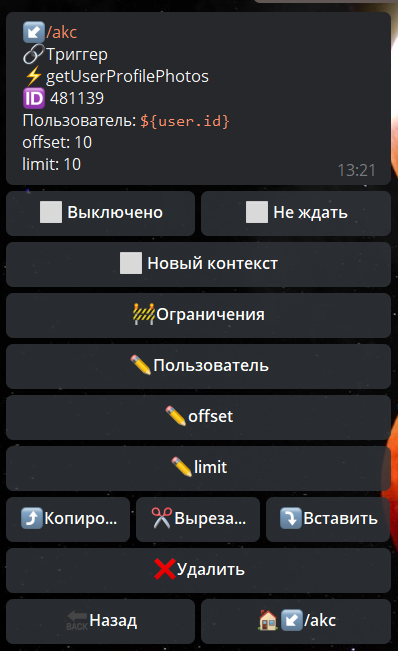
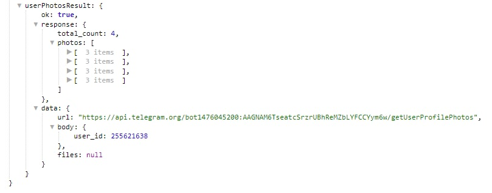

## QNext реакция getUserProfilePhotos

getUserProfilePhotos - получить аватарку(ки) пользователя

Пользователь - указываем ID пользователя, чьи аватарки надо загрузить.

offset - порядковый номер первой загружаемой фотографии

limit - количество загружаемых аватарой

Информация будет доступна в переменной:

_${userPhotosResult}_

**ОСОБЕННОСТИ**:

Можно загрузить не более 100 аватарок за 1 запрос

::: tip
[**getUserProfilePhotos  method bot.api**](https://core.telegram.org/bots/api#getuserprofilephotos)
:::

[QNext. Чаты](/docs-test/ph/QNext-admin-chat-about-07-05)

[QNext. Перечень реакции](/docs-test/ph/QNext-admin-reaction-about-05-01)