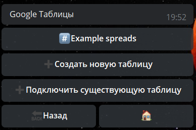
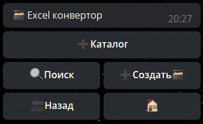
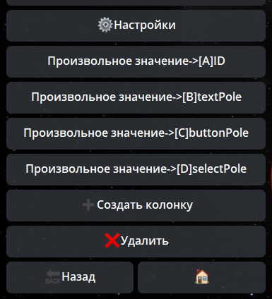

**googleWrite** — позволяет записать в Google таблицу произвольные данные. Для того, чтобы использовать эту реакцию, необходимо провести подготовку.
#### Настройка

Разберем подключение Google таблиц к форме.

Для этого нам потребуется выполнить ряд действий:
 * **Создание форму с необходимыми полями**

Если у вас возникли трудности в вопросах формы, здесь можно подсмотреть инструкцию по ее созданию: [**Инструкция**](https://t.me/QNextCases/120) 
 * **Создание Google таблицы, куда будем сохранять результаты**

🧩Внешние сервисы - Google - Google Таблицы - ➕ Создать новую таблицу

Здесь все довольно просто.
➕ Создать новую таблицу - выбрать аккаунт - ввести название таблицы - готово

 * **Создание Excel-конвертор.**

Самый главный вопрос

➕ Создать - ввести название

➕ Создать колонку - дополнительный параметр:
— название - произвольное
— значение параметра - путь до параметра, пример: ${formResult.data.name.value} 
— колонка - выбираем колонку в которую будет сохранена информация

Таким образом формируем наш Конвертор.

**Пример заполнения**

A - ID - ${user.id}
B - textPole - ${formResult.data.name.value} 
C - buttonPole - ${formResult.data.пол.button.key}
D - selectPole - ${formResult.data.text.button.key}
* **Подключение формы к Конвектору**

Формы - наша форма - триггер финиша - добавить реакцию - ⚡️googleWrite - выбираем созданный Конвертор.

Google страница - выбираем ранее созданную Google таблицу - готово.

[QNext. Глобальные переменные](/docs-test/ph/QNext-admin-GlobalVariables-about-05-08)

[QNext. Перечень реакции](/docs-test/ph/QNext-admin-reaction-about-05-01)

