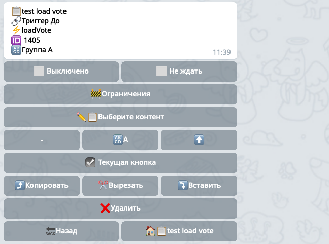

⚡️**loadVote **- загрузить голоса кнопки для дальнейшей работы с ними, позволяет узнать есть ли голос в указанной кнопке.

По умолчанию проверяет наличие голосов в текущем опросе на всех кнопках. Но можно указать конкретное голосование и даже конкретную кнопку. Если включить опцию ☑️Текущая кнопка - тогда будет проверяться голос на той кнопку, на которую нажали.

Очень часто пользователи пытаются создать кнопку Статистика в голосовании. При этом они желают, чтобы эта кнопка была доступна только тем, кто принял участие в голосовании.

Это осуществимо с помощью реакции ⚡️loadVote. На условную кнопку Статистика нужно установить реакцию ⚡️loadVote, которая проверит наличие голосов в текущем опросе, после этой реакции нужно установить блокирующую реакцию brake или return с условием voteResult ≠ exist (голоса в опросе нет). Таким образом бот с помощью ⚡️loadVote проверит наличие голосов и передаст информацию блокирующей реакции, которая сработает соответственно условию.

[QNext. Голосование](/docs-test/ph/QNext-admin-vote-about-07-05)

[QNext. Перечень реакции](/docs-test/ph/QNext-admin-reaction-about-05-01)