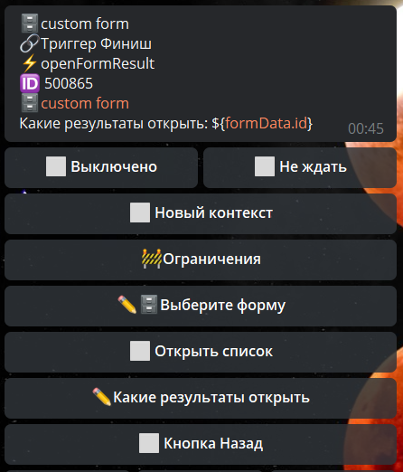

**openFormResult **- открытие результатов формы определенного пользователя. По умолчанию загружаются результаты формы инициатора. 

Можно указать какую форму загрузить и отобразить, или открыть все формы списком.

— Выбрать форму - выбор форму из ранее созданных

— Открыть список - открывает списком все варианты

☑️ Кнопка Назад - включение или отключение возможности возвращаться к списку результатов форм после выбора определенного результата.

[QNext. Форма](/ph/QNext-admin-forms-about-05-09)

[QNext. Перечень реакции](/ph/QNext-admin-reaction-about-05-01)