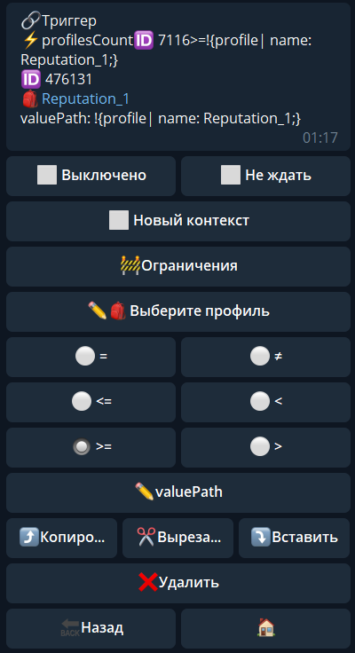
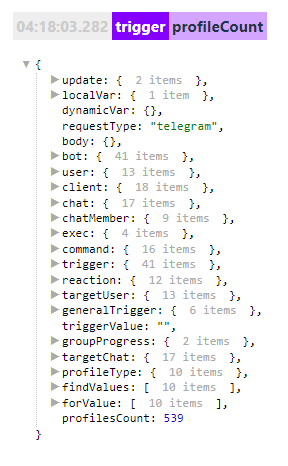

**profilesCount **- проверяет у скольких людей параметр профиля соответствует указанному условию.

Вот так будет выглядеть в логах: 

Нужный нам параметр будет храниться по пути: 
* ${profilesCount} 

#### ОСОБЕННОСТИ:

Не ограничен первыми 200 пользователями, может обработать и проверить хоть миллион

[QNext. Профили](/docs-test/ph/QNext-admin-profile-about-04-25)

[QNext. Перечень реакции](/docs-test/ph/QNext-admin-reaction-about-05-01)

[QNext. Документация](/docs-test/ph/QNext-admin-documentation-05-08)

