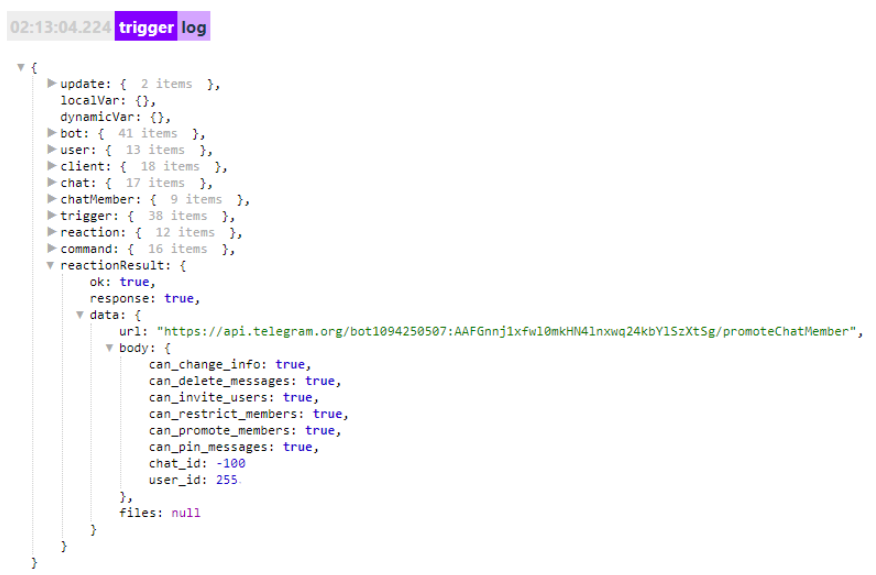
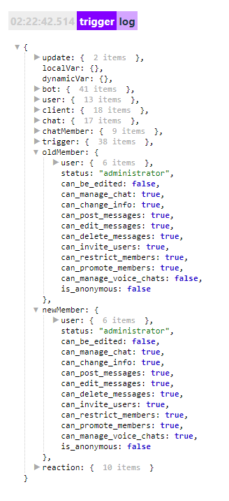

**promoteChatMember **- реакция позволяет выдавать права администратора в чате от имени бота, а так же изменять и забирать права у админов, назначенных ботом.

**В логах реакция примененная в чате выглядит следующим образом:**

* **can_change_info **- разрешение менять профиль чата (фото, био, и прочее)
* **can_delete_message **- разрешение удалять сообщения других участников чата
* **can_invite_users **- разрешение приглашать участников чата
* **can_restrict_members **- разрешение ограничивать (исключать и банить) участников чата
* **can_promote_members **- разрешение назначать в админы участников чата
* **can_pin_message **- разрешение закреплять сообщения в чате

**В логах реакция примененная в канале выглядит следующим образом:**

✔️ — возможно изменить (есть в управлении канала)

➖ - невозможно изменить (отсутствует в управлении канала)
* ➖**can_be_edited **— разрешение редактировать сообщения
* ➖**can_manage_chat **— разрешение управлять чатом
* ✔️**can_change_info **— разрешение изменять профиль канала 
* ✔️**can_post_messages **— разрешение публиковать посты в канале 
* ✔️**can_edit_messages **— разрешение редактировать чужие посты в канале 
* ✔️**can_delete_messages **— разрешение удалять чужие публикации в канале
* ✔️**can_invite_users **— разрешение добавлять пользователей в канале (лимит Телеграма до 200 первых подписчиков) 
* ➖**can_restrict_members **— разрешение управлять пользователями
* ✔️**can_promote_members **— разрешение назначать админов в канале
* ✔️**can_manage_voice_chats **— разрешение управлять голосовым чатом в канале (запускать и останавливать)
* ➖**is_anonymous **— анонимность

[QNext. Перечень реакции](/ph/QNext-admin-reaction-about-05-01)

[QNext. Документация](/ph/QNext-admin-documentation-05-08)

