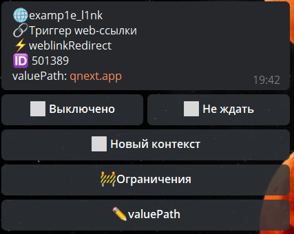

**weblinkRedirect** - реакция позволяет перенаправить пользователя на другой адрес. Адрес можно указать сразу в реакции, или с помощью переменной, которая будет отдавать ссылку.

Реакция предусмотрена для раздела: 
::: tip
WEB — web - ссылки — триггер Web-ссылки
:::

[QNext. WEB](/docs-test/ph/QNext-admin-web-about-09-11)

[QNext. Перечень реакции](/docs-test/ph/QNext-admin-reaction-about-05-01)

