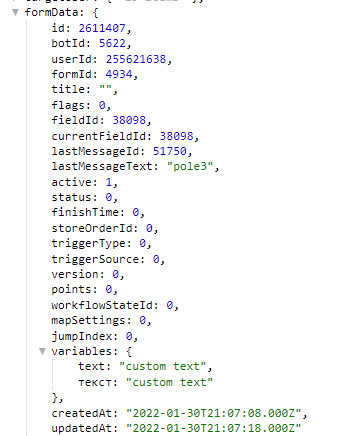

**saveFormVariables **- сохранение локальные переменных при запуске формы, а так же во время прохождения формы.

Локальные переменные доступны в любой момент во время заполнения формы. Получить значения можно в переменной ${formData.variables...}.

#### Особенности:

Все последующие реакции будут перезаписывать, а не дополнять перечень сохраненных переменных, т.о. если вам нужно сохранить ранее созданные переменные, их придется пересоздать с помощью ЛП.

[QNext. Форма](/ph/QNext-admin-forms-about-05-09)

[QNext. Перечень реакции](/ph/QNext-admin-reaction-about-05-01)

