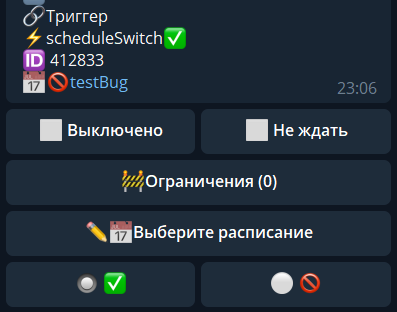

scheduleSwitch - включить/выключить расписание

Состояние можно выбрать в настройках реакции. Реакцию можно использовать, например, чтобы закрыть расписание по расписанию.

[QNext. Перечень реакций](/ph/QNext-admin-reaction-about-05-01)

[QNext. Документация](/ph/QNext-admin-documentation-05-08)