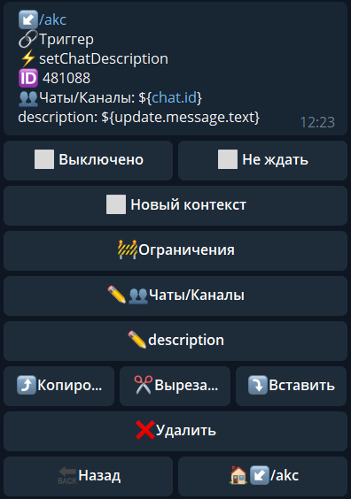

**setChatDescription **- изменить описание чата

Чаты/Каналы - указываем чат в котором необходимо выполнить действие

title - текст, на который необходимо изменить описание

**ОСОБЕННОСТИ**:

Максимум 255 символов.

::: tip
[**setChatDescription method bot.api**](https://core.telegram.org/bots/api#setchatdescription)
:::

[QNext. Чаты](/docs-test/ph/QNext-admin-chat-about-07-05)

[QNext. Перечень реакции](/docs-test/ph/QNext-admin-reaction-about-05-01)