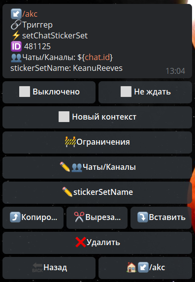

**setChatStickerSet **- установить стикерпак для группы.

Чаты/Каналы - указываем чат в котором необходимо выполнить действие

stickerSetName - указываем название стикерпака. Рекомендуем смотреть название с помощью логов. Оно может отличаться от того, которое видно в клиенте.

**ОСОБЕННОСТИ**:

В чате должно быть минимум 100 человек

::: tip
**setChatStickerSet method bot.api**
:::

[QNext. Чаты](/docs-test/ph/QNext-admin-chat-about-07-05)

[QNext. Перечень реакции](/docs-test/ph/QNext-admin-reaction-about-05-01)

