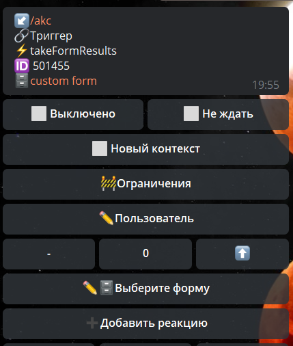

**takeFormResults **- загружает указанное количество результат форм пользователя с конца.

Реакция для обработки результатов форм пользователя.

ID Результатов будут находится по пути: ${formDataList.0.id}

[QNext. Форма](/ph/QNext-admin-forms-about-05-09)

[QNext. Перечень реакции](/ph/QNext-admin-reaction-about-05-01)