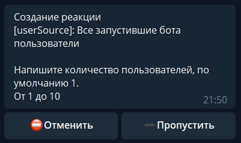

takeRandomUser - взять в случайном порядке пользователей.

На выбор есть 4 варианта:

 * Все запустившие бота пользователи
 * Список пользователей
 * Проголосовавшие пользователи (выбирается определенный контент)
 * Заполнившие форму

После выбора откуда брать пользователей, можно указать количество, от 1 до 10.

По умолчанию берется 1 пользователь.

Пример применения:
* Отправить сообщение случайным пользователям бота

takeRandomUser - все пользователи

— sendMessage

[QNext. Пользователи](/ph/QNext-admin-users-about-05-27)

[QNext. Перечень реакций](/ph/QNext-admin-reaction-about-05-01)

