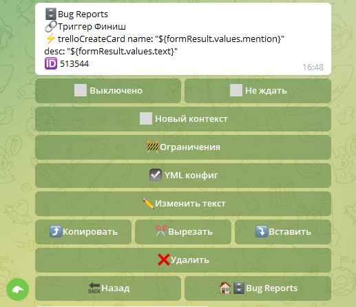

Реакция ⚡️trelloCreateCard которая создаст карточку в указанном списке на доске trello. Чтобы создать карточку, в тексте реакции необходимо указать **yaml конфиг** со всеми параметрами которые trello требует для создания карточки. Список всех параметром можно посмотреть в [официальной документации Trello](https://developer.atlassian.com/cloud/trello/rest/api-group-cards/#api-group-cards) 

**Пример**
::: tip
name: "${formResult.values.mention}" desc: "${formResult.values.text}" 
:::

[QNext. Trello](/ph/QNext-admin-trello-about-02-16)

[QNext. Перечень реакции](/ph/QNext-admin-reaction-about-05-01)

