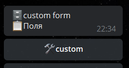

## QNext admin reaction writeFormCustom

**writeFormCustom** - реакция связанная с полем форме: **custom.** 

Позволяет принимать совершенно любой текст или файлы/медиа.

По умолчанию, поле не будет принимать какие-либо данные, пока в триггере подготовки поля не указать соответствующую реакцию **writeFormCustom.** 

Пример использования.

Задача: нам принять данные, только если это:

@username — mention

ссылка — utl

Как нам это выполнить?

Триггер подготовки

**for** _${update.message.entities}_

— **groupReactions** 

Ограничения:

_string ${forItem.value.type}=mention_

  or

_string ${forItem.value.type}=url_

— — **writeFormCustom** _${update.message.text}_

[QNext. Форма](/docs-test/ph/QNext-admin-forms-about-05-09)

[QNext. Перечень реакции](/docs-test/ph/QNext-admin-reaction-about-05-01)