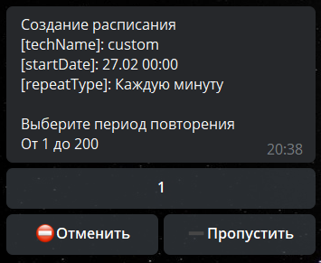
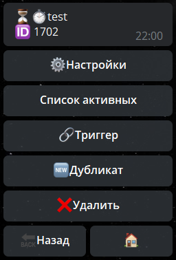

Расписание - выполнение заранее настроенных действий в указанное время.

#### Оглавление
* [**Общие расписания**](#общие-расписания)
* [**Отложенные действия**](#отложенные-действия)

#### Общие расписания

[**Видео-курс по созданию расписания**](https://t.me/QNextCases/122)
#### Создание 

Создание расписания простое и понятное, обращу внимание лишь на один этап:

**Период повторения**

Если выбрать 
* "Частота повторения" - 1 минута
* "Период повторения" - 5, 

то Расписание будет срабатывать раз в 5 минут.

#### Настройки расписания

— **⚙️Настройки:**
* Тех название - изменить техническое название расписания
* Удалить расписание после выполнения (расписание удаляется полностью, дабы не засорять список расписаний)

— **☑️Включено** - включение или отключение расписания.

Расписание можно отключить реакцией:
[**scheduleSwitch**  ](/ph/QNext-admin-reaction-scheduleOn-05-09)- Изменить состояние расписания

— **Дата выполнения, Повторять, Период повторения** - соответствуют настройкам при создании расписания.

— **Исключения **- настройка дней и времени, когда расписание не будет срабатывать.
* **Исключить время** - можно настроить что расписание будет только с утра до вечера, или наоборот только ночью.
* **Исключить день** - можно настроить что расписание будет работать только в будни, или наоборот, только в выходные.

— **Дата завершения **- дата когда расписание будет завершено.

— **Триггер **- главный раздел, здесь необходимо указывать все реакции, которые должно выполнить расписание. Подробнее о реакциях [**можно узнать здесь**](/ph/QNext-admin-reaction-about-05-01).

— **Проверить **- запускает расписание. 
!! Важный момент, у расписания инициатора нет. Все реакции типа loadProfile или sendMessage без реакций типа ta(takeUsers takeChat) корректно работать не будут!!

— **Дубликат **- создание точной копии расписания
::: tip
[**Вернуться к оглавлению**](#оглавление)
:::
#### Отложенные действия

Отложенные действия (далее ОД) - действия выполняемые после совершения действия пользователем.

Имеет 3 режима работы:
* **Относительное время** — ОД будет выполнено через N времени после запуска
* **Абсолютное время **— Выбрать день, в который будет срабатывать ОД.
* **В указанный день недели **— выбрать дни, в которые будут срабатывать ОД.

— **Настройки**
* Тех. название - название которое будет видно в списке ОД.
* Режим работы:

**Режим по умолчанию** - запускает ОД, при попытке повторного запуска ОД ничего не произойдет.

**Режим замены** - запускает ОД, при повторном запуске перезапускает ОД.

**Режим добавления** - запускает ОД, при повторном запуске создает еще одно ОД.

— **Триггер **- главный раздел, здесь необходимо указывать все реакции, которые должно выполнить ОД. Подробнее о реакциях [**можно узнать здесь**](/ph/QNext-admin-reaction-about-05-01).

— **Дубликат **- создание точной копии ОД.

[**Вернуться к оглавлению**](#оглавление)

[**QNext. Документация**](/ph/QNext-admin-documentation-05-08)