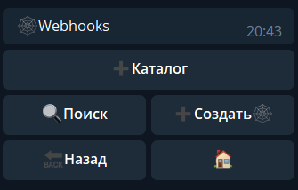
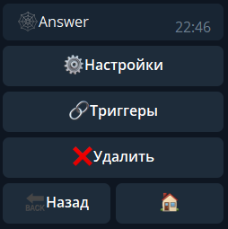
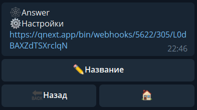
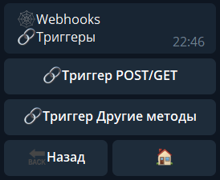

## QNext раздел webhooks

**Webhook** — механизм оповещения системы (бота в нашем случае) о событиях. С его помощью можно создать ссылку бота, которую может выполнить любой внешний ресурс.

Процесс создания прост. 

Создать - придумать название - готово.

**Интерфейс:**

**Настройки:**

Здесь мы можем изменить название придуманное ранее, а так же ссылку.

Ссылка нужна для того бы любой сервис мог присылать на нее сведения, а бот в свою очередь их распознавал, и обрабатывал.

**Триггеры**:

 В тригере вебхука есть параметр ${request...}, который содержит в себе тип запроса (GET/POST), переданные параметры (query, body) и заголовки (headers). В тригере также можно ответить на запрос, с помощью реакции ⚡️**webhookResponse**.

С этим разделом напрямую связана реакция:
[**webhookResponse** ](/docs-test/ph/QNext-admin-reaction-webhookResponse-05-09)- Ответ для webhook's

 

[QNext. WEB](/docs-test/ph/QNext-admin-web-about-09-11)

[QNext. Документация](/docs-test/ph/QNext-admin-documentation-05-08)