В этой статье разберем вопросы подключения бота к @Qnextbot, а так же обновление токена в уже подключенном боте. 

Разберем эти вопросы в 2 этапа:
#### Оглавление

[**Получение токена**](#получение-токена)
* [Создание нового бота](#создание-нового-бота)
* [Получение токена для имеющегося бота](#получение-токена-для-имеющегося-бота)

[**Регистрация бота в @Qnextbot**](#регистрация-бота)
* [Подключение бота в @Qnextbot](#первое-подключение-бота)
* [Обновление имеющегося токена](#обновление-токена)

#### Получение токена
#### Создание нового бота

Необходимо открыть Telegram, найти системного бота @BotFather и начать с ним диалог;

@BotFather — это официальный Telegram бот, который создает и регистрирует другие боты в мессенджере.

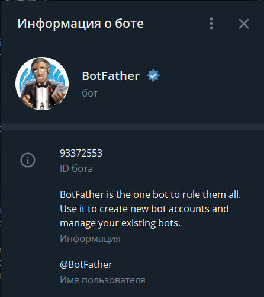

Вводим команду: /newbots
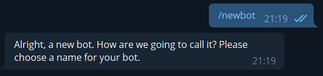

Здесь вам необходимо придумать имя вашему боту.
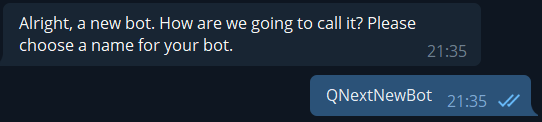

Следующий шаг самый важный - придумать юзернейм боту.
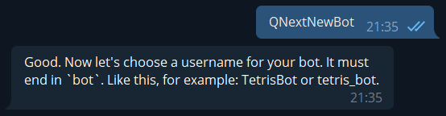

Здесь вам необходимо придумать юзернейм вашему будущему боту. Формат юзернейма: @Название+bot
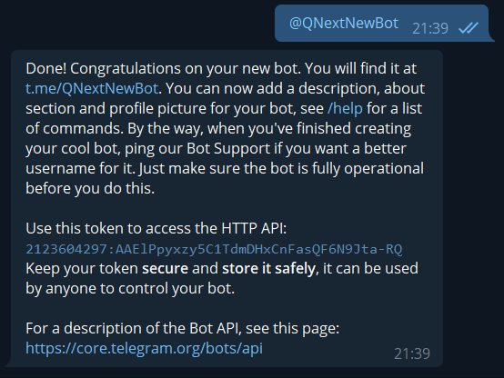

Поздравляем, бот зарегистрирован! 

Для привязки вашего бота к сервису [Qnextbot](http://t.me/Qnextbot) будет необходимо ввести API ключ в соответствующее окно в личном кабинете.

**API ключ — секретный код, который позволяет настроить связь с ботом вне клиента Telegram.**

Вот это наш токен: **2123604297:AAElPpyxzy5C1TdmDHxCnFasQF6N9Jta-RQ**

Копируем полученный токен, и переходим к 3 этапу: 

[Подключение бота в @Qnextbot](#первое-подключение-бота)
::: tip
[**Вернуться к Оглавлению**](#оглавление)
:::

#### Получение токена для имеющегося бота

Заходим в бота: **@BotFather**
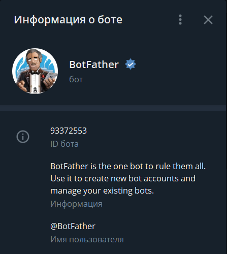

Вводим команду: **/mybots**
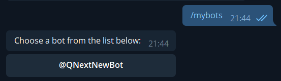

Находим нашего бота, чей токен нужно обновить, и нажимаем на кнопку юзернеймом вашего бота. 
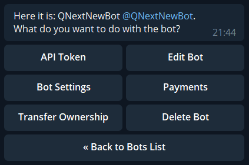

Здесь нас интересует кнопка: **API Token**, нажимаем, заходим в раздел.
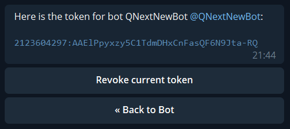

Нажимаем на кнопку: **Revoke current token**
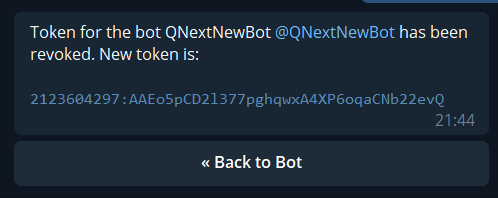

Получаем новый токен, его нам необходимо скопировать. 

После копирования токена, переходим 3 этапу: 

[Обновление имеющегося токена](#обновление-токена)
::: tip
[**Вернуться к Оглавлению**](#оглавление)
:::

#### Регистрация бота

Находим  главного бота для подключения вашего бота к сервису: [@Qnextbot](http://t.me/Qnexbot)
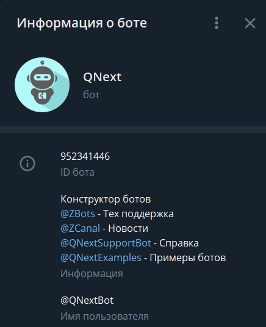

Запускаем бота, выбираем язык
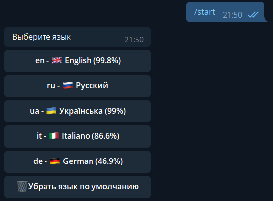

Если вы первый раз в проекте, рекомендую изучить обучение. Если вы уже ранее регистрировали ботов, обучение можно пропустить.
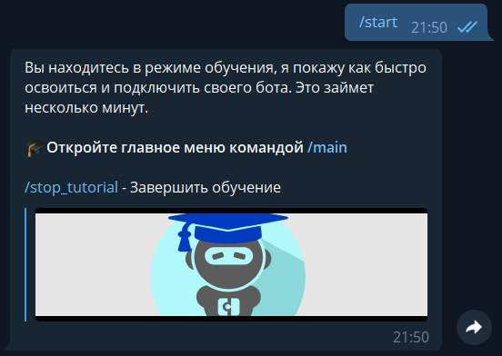

После прохождения обучения, нам открывается главное меню бота:
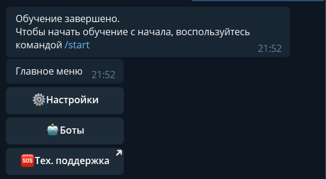

Нам нужна кнопка "Боты" - заходим туда
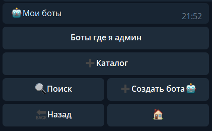
::: tip
[**Вернуться к Оглавлению**](#оглавление)
:::

#### Первое подключение бота

- нажимаем на кнопку **"Создать бота"**
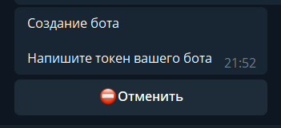

И вот здесь нам нужен ранее скопированный токен, вставляем токен
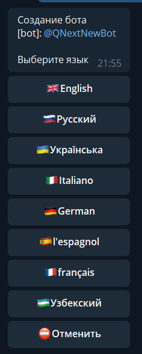

далее выбираем язык бота. На этом языке будут все тексты в боте по умолчанию.
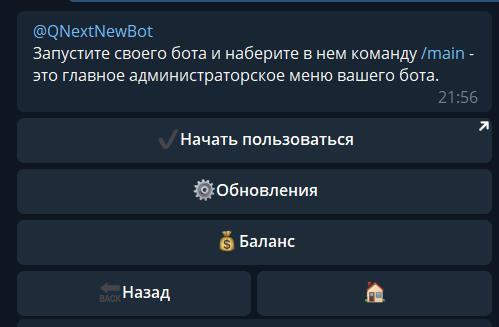

Готово! Можно начинать работать!
::: tip
[**Вернуться к Оглавлению**](#оглавление)
:::

#### Обновление токена
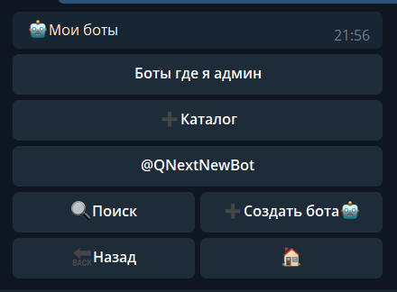

Выбираем нужного бота
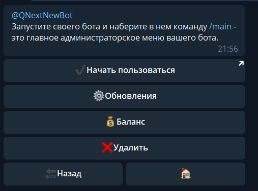

Здесь нам потребуется кнопка "**Обновления**"
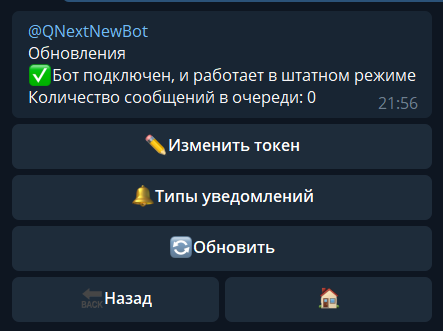

Видим кнопку "**Изменить токен**"
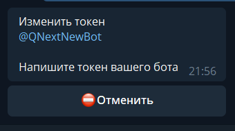

Вводим ранее скопированный токен
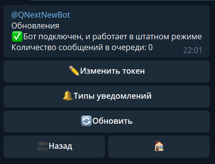

Готово! Вы молодцы!
::: tip
[**Вернуться к Оглавлению**](#оглавление)
:::

[QNext. Документация](/ph/QNext-admin-documentation-05-08)