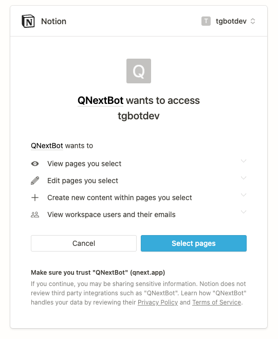
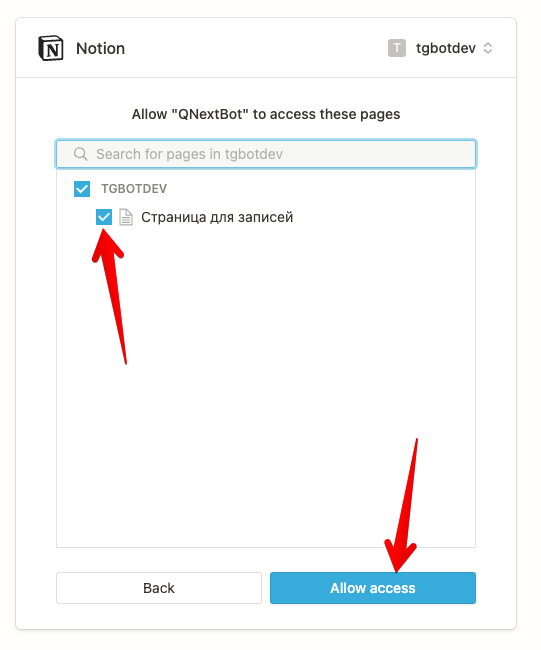
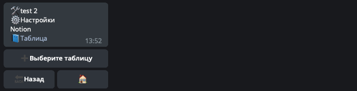
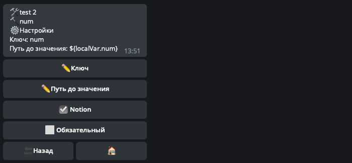

## QNext Модели данных
* [Терминология](#терминология)
     * [🛠База данных](#🛠база-данных)
    * [🔩Запись](#🔩запись)
    * [🔨Поле](#🔨поле)
    * [🔧Запросы](#🔧запросы)
    * [⚙️Итераторы](#⚙️итераторы)
    * [Воркеры](#воркеры)
* [⚡️Реакции](#⚡️реакции)
* [Синхронизация с Notion](#синхронизация-с-notion)
* [🚫Ограничения](#🚫ограничения)

### Терминология
### 🛠База данных

База данных (или просто база) - набор всех записей которые хранятся в модели. Под капотом используется база данных [mongodb](https://docs.mongodb.com/manual/reference/method/js-collection/).
### 🔩Запись

Запись - элемент хранимый в базе, которая может быть привязана к пользователю или к участнику чата, или вообще без привязки к юзерам. По сути это объект который хранит в себе множество каких то свойств. Записи можно создать реакцией dataCreate, а получить реакциями dataFind и dataGet. Например вот так может выглядеть запись:
::: tip
{  "fields" : {   "num" : 123,   "text" : "abc"  },  "createdAt" : "2022-01-25T10:25:55.481Z",  "dataModelId" : 1,  "userId" : 129999262,  "chatId" : 0,  "expireAt" : "2022-01-25T20:25:55.481Z",  "id" : 30,  "_id" : "61efd03374e89dcc32e68d5e", } 
:::

Здесь имеются системные свойства(переменные): `createdAt, userId chatId, expireAt, dataModelId, id, _id`. А так же имеются кастомные свойства, лежащие в объекте `fields` - это поля. 
### 🔨Поле

Поле - некое свойство(значение) которое создает разработчик, чтобы указать бота какие данные необходимо сохранить в записи. В примере выше, полями являются две переменные: `num` и `text`. Поля могут быть разных типов:
* number - число
* boolean - true или false
* string - строка(текст)
* date - дата
* file - файл полученные в с помощью телеграм
* object - любой объект
### 🔧Запросы

Запрос - это набор правил для поиска нужной записи в базе. В запросе можно указать например что надо найти записи от текущего юзера(инициатора команды) или например указать что какое то значение поля равно или не равно какому то значению. 
### ⚙️Итераторы

Итератор - механизм позволяющий обработать все записи из базы, по определенному условию. У итератора есть 🔗триггер итерации, который выполняется для каждой записи по очереди. Чтобы итератор начал работу, надо запустить воркер итератора. 
### Воркеры

Воркер(worker) - это запущенный процесс итератора. Воркеров может быть одновременно несколько и каждый будет выполнять свою работу независимо. 
### ⚡️Реакции
* ⚡️dataCreate - создать запись в базе
* ⚡️dataCount - посчитать количество записей в базе
* ⚡️dataDeleteOne - удалить одну запись из базы по id этой записи
* ⚡️dataDeleteMany - удалить из базы множество записей, удовлетворяющих запросу
* ⚡️dataFind - найти в базе записи удовлетворяющие запросу
* ⚡️dataGet - найти в базе 1 запись по id этой записи
* ⚡️dataUpdateOne - обновить в базе одну запись по id этой записи
* ⚡️dataUpdateMany - обновить в базе записи удовлетворяющие запросу
* ⚡️dataWorkerStart - запустить воркер
* ⚡️dataWorkerStop - остановить воркер
* 
### Синхронизация с Notion

Модели данных могут синхронизироваться с таблицей Notion - т.е. при создании новой записи в модели, запись автоматически будет создана и в Notion таблице. Так же при удалении и обновлении записей. Включение такой интеграции условно делится на 2 шага:
* [Авторизация notion-workspace](#авторизация-notion-workspace)
* [Настройки модели данных](#настройки-модели-данных)
### Авторизация notion-workspace

Создайте в корне Notion Страницу, доступ к которой вы будете предоставлять боту. Внутри этой страницы создайте **Таблицу**, в которую бот будет записывать данные. После этого откройте раздел:
::: tip
🧩Внешние сервисы -> Notion -> Workspaces 
:::

и нажмите кнопку `➕Добавить workspace`. В появившемся окне нажмите кнопку **Select pages**:

В следующем окне поставьте галочки напротив страниц, к которым вы хотите разрешить доступ боту и нажмите кнопку **Allow access**:

Если все прошло удачно, бот напишет вам текст что Workspace добавлен. На этом все, теперь необходимо настроить саму модель на отправку данных в Notion.
### Настройки модели данных

 В меню модели данных откройте раздел ⚙️Настройки -> 📘Notion и нажмите кнопку ➕**Выберите таблицу**:

После этого бот попросит сперва выбрать Workspace, а затем страницу внутри этого workspace. Если вы сделали все правильно, в меню настроек появится ссылка на выбранную notion-таблицу. 

Затем откройте ⚙️Настройки полей которые вы хотите записывать в Notion-таблицу и поставьте галочки ☑️Notion:

Теперь после выполнения реакции ⚡️dataCreate - в Notion появится аналогичная запись. При обновлении реакций ⚡️dataUpdateOne - запись обновится и в Notion. После удаления записи реакцией ⚡️dataDeleteOne - запись также будет удалена из Notion.

### 🚫Ограничения
* 50 полей на 1 запись.
* Не более 100кб на одну запись
* Если поле строковое - не более 4000 символов на 1 поле. 
* Также применяются [ограничения](https://docs.mongodb.com/manual/reference/limits/) накладываемые самой базой mongodb.
* Время выполнения запроса - 500 мс. Для уменьшения времени выполнения поисковых запросов необходимо использовать **индексы**.
* К сожалению у Notion очень жесткие ограничения, и делать запросы api можно не чаще чем 1 раз в секунду. В связи с этим при включенной синхронизации, для этой модели не доступны реакции ⚡️dataUpdateMany и ⚡️dataDeleteMany.

[Original](https://telegra.ph/QNext-admin-data-models-about-01-25)