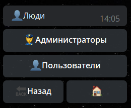
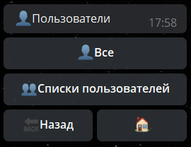
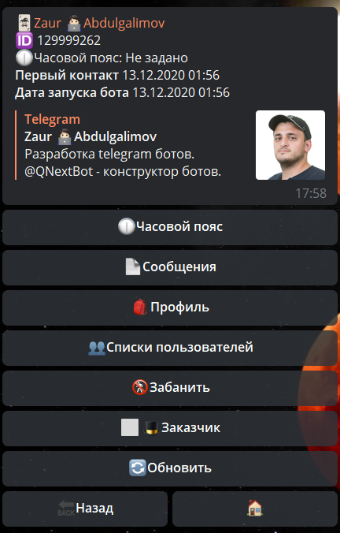
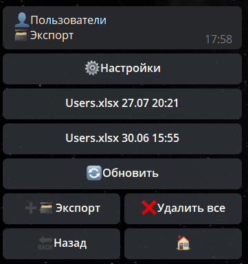

## QNext. Люди

Люди - раздел отвечающий за работу с пользователями бота. 

Раздел "Люди", разделён на 2 подменю:
### Оглавление

— [**Администраторы**](#администраторы)

— [**Пользователи**](#пользователи)

* [**Все**](#все)
* [**Списки пользователей**](#списки-пользователей)
* [**Экспорт/Импорт**](#экспорт/импорт)

### Администраторы

Администраторы делятся на 3 категории:
* 👑 Создатель — имеет полные права над ботом. 
_Может назначать админов, удалять админов, удалить бота._
* 👮 Администратор — имеет полные права внутри бота. 
_Может назначать админов, но не может их удалять._
* 👨🏻‍💻 Ограниченный администратор — имеет доступ только к разделам, в которых ему разрешил доступ Создатель или Администратор.
::: tip
[Вернуться к оглавлению](#оглавление)
:::
### Пользователи

В разделе пользователи находятся 2 подраздела:
* [**Все**](#все)
* [**Списки пользователей**](#списки-пользователей)
* [**Экспорт/Импорт**](#экспорт/импорт)

::: tip
[Вернуться к оглавлению](#оглавление)
:::
### Все

В разделе пользователи находятся все пользователи бота, а так же те, кого хотя бы раз видел бот:
* Человек запустил бота
* Человек писал в чате где есть бот
* Человек нажимал на кнопки бота

Все пользователи бота разделены на 5 групп:

♠️Пользователь НЕ запускал бота в привате

🃏Пользователь запустил бота в привате

🚫Пользователь заблокировал бота

☢️Аккаунт пользователя удален

🚷Пользователь забанен в боте
::: tip
[Вернуться к оглавлению](#оглавление)
:::

**Профиль пользователя бота**

В этом разделе можно увидеть и использовать следующие функции:
* 🕧Часовой пояс — возможность установить персональный часовой пояс. По умолчанию установлен часовой пояс по [**UTC**](https://ru.wikipedia.org/wiki/%D0%92%D1%81%D0%B5%D0%BC%D0%B8%D1%80%D0%BD%D0%BE%D0%B5_%D0%BA%D0%BE%D0%BE%D1%80%D0%B4%D0%B8%D0%BD%D0%B8%D1%80%D0%BE%D0%B2%D0%B0%D0%BD%D0%BD%D0%BE%D0%B5_%D0%B2%D1%80%D0%B5%D0%BC%D1%8F).
* Сообщение — отправить сообщение пользователю.
* Профиль — показать содержимое профилей пользователя. Подробнее можно [**прочитать здесь**](/docs-test/ph/admin/profile-about).
* Списки пользователей — покажет в каких списках находится пользователь.
* Забанить — полная блокировка пользователя в боте. Бот перестанет реагировать на пользователя. Реакция для бана:
 [**banBotUser** ](/docs-test/ph/reactions/banbotuser)— Забанить/Разбанить юзера в боте
* Заказчик — можно назначить 1 заказчика. Подробнее можно [**прочитать здесь**](/docs-test/ph/admin/price-about)
::: tip
[Вернуться к оглавлению](#оглавление)
:::
### Списки пользователей

Списки пользователей - удобный механизм для сортировки пользователей.

С этим разделом связаны следующие сущности:

[Списки пользователей - реакции](/docs-test/ph/admin/userlist-about)

[Ограничение isChatMember](/docs-test/ph/restrictions)
::: tip
[Вернуться к оглавлению](#оглавление)
:::
### Экспорт/Импорт

Экспорт — выгрузка списков пользователей бота в Excel файл с помощью **Конвертора.** Файл будет выгружен в формате .xlsx

Импорт - загрузка списков пользователей в бота из файла с помощью **Конвертора.**

* ‼️ При загрузке бот проверяет доступность каждого юзера, и добавляет в базу только тех, у кого был запущен диалог с ботом в момент проверки ‼️
* ‼️ Файл должен содержать колонку с ID юзеров ‼️ 
::: tip
[Вернуться к оглавлению](#оглавление)
:::

[QNext. Документация](/docs-test/ph)

[Original](https://telegra.ph/QNext-admin-people-about-02-13)