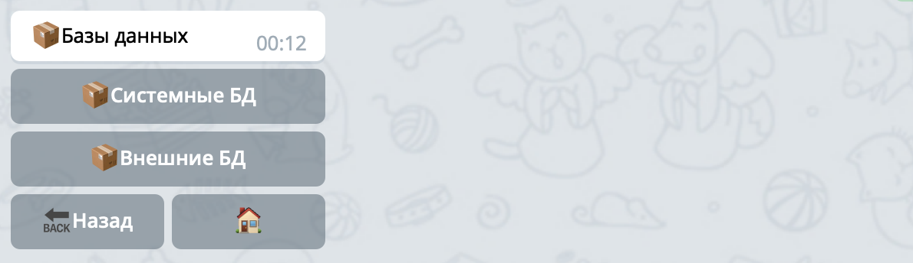

## QNext. Базы данных
* [О базах данных](#о-базах-данных)
* [Системные БД](#системные-бд)
  * [MongoDB](#mongodb)
* [Внешние БД](#внешние-бд)
### О базах данных

В главном меню конструктора [QNextBot](http://t.me/qnextbot) появился раздел `📦Базы данных`:

Далее для сокращения базы данных будет называть коротко БД или db - database.

На платформе QNext существуют два типа баз данных:
* Системные БД
* Внешние БД
### Системные БД

Системные базы данных, это бд которые лежат непосредственно на платформе qnext. Персонально для вашего бота создается отдельная база данных, вы получаете доступ к ней из своего бота. Вы можете создавать внутри своей БД любые таблицы и коллекции. При создании такой БД, вы берете на себя ответственность за корректную работу с базой, создание индексов для оптимизации ваших запросов. Если запросы от вашего бота к вашей базе данных буду слишком долгими из-за отсутствия индексов, платформа оставляет за собой право ограничить работу такой БД. За подключение и настройку новой БД в вашем боте взымается разовая плата. В дальнейшем взымается ежемесячная плата, в зависимости от размера вашей БД. Чтобы получить доступ к БД, войдите в раздел Системные БД и нажмите кнопку `Получить доступ`. 

На текущий момент поддерживаются только базы данных типа MongoDB. В будущем будут подключены и другие базы данных, такие как mysql, postgresql, clickhouse и другие.
### MongoDB

После того как база данных была подключена, вы можете обратится к вашей базе из скрипта. Создайте реакцию ⚡️runScript и напишите код:
::: tip
const databaseId = 123; const user = qnext.getValue("user"); async function run() {  const db = await qnext.databases.system({id: databaseId});  if (!db) {    qnext.onFinish('database not found');    return;  }     db.collection('users').insertOne({    _id: user.id,    name: user.name,    username: user.username,  });   const users = await db.collection('users').find().toArray();  out.users = users;     qnext.onFinish('complete'); }  run(); 
:::

Не забудьте поменять databaseId на 🆔 вашей БД и включить для скрипта [Асинхронный режим](/docs-test/ph/script). Данный код создаст коллекцию users, запишет в неё нового пользователя(`insertOne`) с 3 полями(`_id, name и username`) а затем пройдется поиском (`find`) и вернется список пользователей. Подробно про работу с MongoDB читайте на сайте [mongodb.com](https://www.mongodb.com/). На платформе qnext используется mongo [драйвер для nodejs](https://www.npmjs.com/package/mongodb).

### Внешние БД

Внешние БД, это базы данных лежание на внешних серверах, вы разместить такую базу на своем сервере или купить аренду БД у компаний предоставляющих облачные ресурсы. При настройки подключений вы указываете хост, логин, пароль и другие параметры для работы с БД. Плата за работу таких БД на платформе qnext не взымается. 

На текущий момент этот раздел находится в разработке. Но в будущем можно будет подключить такие базы как mysql, mongodb, postgresql, clickhouse и другие.

  
[Original](https://telegra.ph/QNext-Databases-01-30)