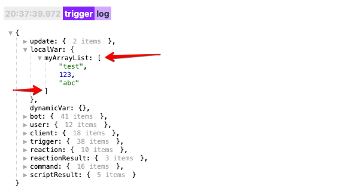

## QNext. Макрос array

[⬅️QNext. Макросы](/docs-test/ph/macros)

Макрос позволяет делать различные манипуляции со списками(массивами, Array в терминологии JavaScript). Для работы с этим макросом, у вас должен где то лежать список(массив) элементов. Это может быть локальная или глобальная переменная, или какой то результат выполнения скрипта. Найти список(массив) можно в логах. В логах списки(массивы) помечаются квадратными скобками `[ ... ]`:

В этом примере у нас в `localVar` переменных лежит локальная переменная `myArrayList`, которая является список, и в этом списке у нас 3 элемента:
1 текст "test"
2 число 123
3 текст "abc"

Чтобы ботом вывести например количество элементов этого списка, вы можете воспользоваться макросом:
::: tip
!{array|   path: localVar.myArrayList;   type: length; } 
:::

Макрос выполняет различные действия, в зависимости от значения параметра `type`:
* type: length
* type: indexOf
* type: lastIndexOf
* type: join
* type: at

### type: length

Количество элементов в списке:
::: tip
!{array|   path: localVar.myArrayList;   type: length; } 
:::
### type: indexOf

Найти номер позиции элемента в списке. Например вы хотите найти в какой позиции находит текст `"abc"`:
::: tip
!{array|   path: localVar.myArrayList;   type: indexOf;   element: abc; } 
:::

Макрос вернет значение `2`, потому что позиционирование элементов а массиве начинается не с `1` с номера `0`.
### type: lastIndexOf

Тоже самое что и `type: indexOf`, только поиска начинается с конца массива:
::: tip
!{array|   path: localVar.myArrayList;   type: lastIndexOf;   element: abc; } 
:::

### type: join

Преобразовывает массив в строку, разделяя элементы разделителем. 
::: tip
!{array|   path: localVar.myArrayList;   type: join;   separator: @; } 
:::

В этом примере мы использовали в качестве разделителя символ @, значит на выходе мы получим вот такую строку:
::: tip
test@123@abc 
:::

Если вы хотите использовать в качестве разделителя пробел, или переход строки, воспользуйтесь [спец символами](/docs-test/ph/macros).

### type: at

Возвращает элемент массив по указанному номеру. Например вы хотите получить из массива элемент с номером `1`:
::: tip
!{array|   path: localVar.myArrayList;   type: at;   index: 1; } 
:::

Макрос вернет значение `123`. Не забывайте что нумерация в массиве начинается не с `1` а с `0`.

[⬅️QNext. Макросы](/docs-test/ph/macros)

[Original](https://telegra.ph/QNext-Macros-Array-04-06)