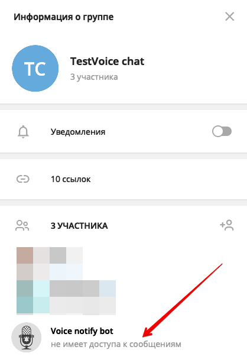

## @voice_notify_bot - инструкция по применению
* [О чем этот бот?](#о-чем-этот-бот?)
* [Как это работает?](#как-это-работает?)
* [Как мне получить ссылку для подписки?](#как-мне получить-ссылку-для-подписки?)
* [Это безопасно?](#это-безопасно?)
* [У меня остались вопросы](#у-меня-остались-вопросы)


### О чем этот бот?

Если вы администратор чата или канала, в котором периодически проходят голосовые обсуждения, бот [@voice_notify_bot](http://t.me/voice_notify_bot) поможет вашим пользователям не пропускать такие голосовые мероприятия. Добавьте бота в ваш канал или чат, и ваши пользователи смогу с помощью бота подписаться на уведомления о начале нового голосового обсуждения. Как только администраторы канала/чата начнут голосовое обсуждения, подписавшиеся на рассылку пользователи получат уведомление.
### Как это работает?
1 Добавьте бота [@voice_notify_bot](http://t.me/voice_notify_bot) в ваш чат или канал. Выдавать боту права администратора не нужно.
2 В чате выполните команду `/subscribe@voice_notify_bot`, бот покажет сообщение со ссылкой, нажав на которую любой участник вашего чата сможет подписаться на рассылку.
3 В канале вы может выполнить команду `/subscribe@voice_notify_bot` один раз, в ответ на это бот покажет ссылку для подписки. После этого вы можете скопировать полученную ссылку, удалить из вашего канала эти сообщения и сделать свой более привлекательный пост с пояснением для чего необходима эта ссылка. Нажав на эту ссылку участники вашего канал смогут подписаться на рассылку.
4 Начните новое голосовое обсуждение и все подписавшиеся участники получат уведомление.
### Как мне получить ссылку для подписки?

Вы можете выполнить в вашем чате/канале команду `/subscribe@voice_notify_bot` чтобы бот показал ссылку для подписки. Если по каким либо причинам вы не можете выполнить в чате/канале такую команду, вы можете просто открыть ссылку вида:
```js 
t.me/voice_notify_bot?start=subscribe_XXX

```

Где `XXX` - это ID вашего чата/канала, например ссылка может выглядеть вот так:
```js 
t.me/voice_notify_bot?start=subscribe_123456789

```

Вы можете опубликовать такую ссылку в вашем чате/канале и тогда ею сможет воспользоваться любой пользователь.


### Это безопасно?

Да, это абсолютно безопасно. В чате бот работает в приватном режиме, это значит что бот не получает сообщений из вашего чата, только системные сообщения, вроде старта голосового обсуждения и `/команд` адресованных ботам. Убедится в том что бот работает в приватном режиме можно в списке участников чата:



Чтобы бот работал в канале, его к сожалению надо сделать администратором, такова особенность работы Telegram. Вы можете дать боту администратора с минимальным набором доступов. Бот не будет ничего публиковать в вашем канале.
### У меня остались вопросы

Приходите в чат тех поддержки [@QBotsSupport](https://t.me/QBotsSupport), будем рады вам помочь.
  
[Original](https://telegra.ph/voice-notify-bot-03-22)