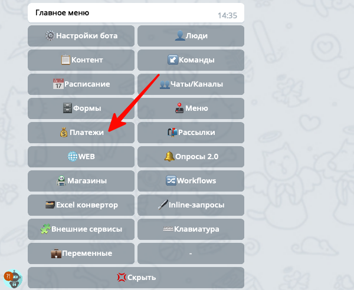
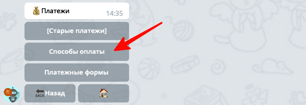
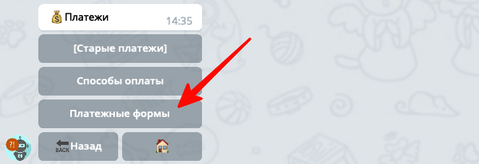
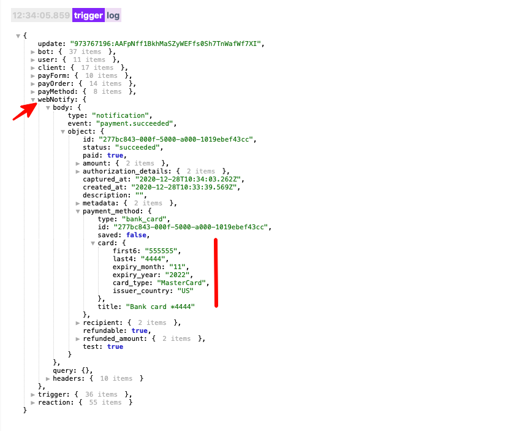
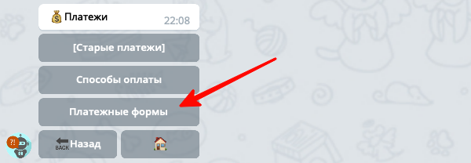
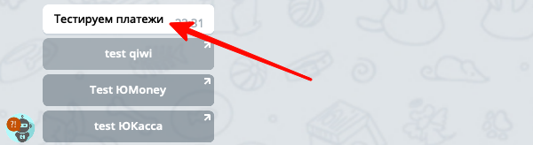
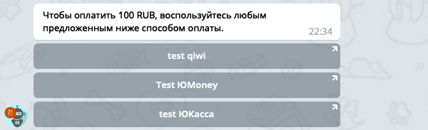

## QNext. Платежи
* [Способы оплаты](#способы-оплаты)
* [Подключение новых способов оплаты ](#подключение-новых-способов-оплаты)
* [Общая схема работы платежей](#общая-схема-работы-платежей)
* [Платежные формы](#платежные-формы)
* [Про безопасность банковских карт](#про-безопасность-банковских-карт)
* [Ошибки](#ошибки)

С помощью платежей в qnext, создатели ботов могут принимать платежи со своих пользователей. 
### Способы оплаты

На текущий момент доступны следующие способы оплаты:
* [QIWI кошелек](/docs-test/ph/pay/qiwi)
* [ЮMoney кошелек](/docs-test/ph/pay/yoomoney-api) (бывшие Яндекс.Деньги)
* [ЮKassa для юр. лиц](/docs-test/ph/pay/yookassa) (бывшая Яндекс.Касса)
* [Нативные Telegram платежи](/docs-test/ph/pay/telegram)
* [ROBOKASSA](/docs-test/ph/pay/robokassa)
* [PAYEER](/docs-test/ph/pay/payeer)
### Подключение новых способов оплаты

К сожалению некоторые платежные системы не предоставляют тестовый доступ к API. И создать полноценный аккаунт не всегда получается, по ряду причин, например отсутствие гражданства страны, где находится платёжка. Поэтому если вы хотите чтобы мы реализовали интеграцию с вашей платежной системой, у вас должен быть аккаунт с доступом к API. Если у вас есть аккаунт в платежной системе, интеграцию с которой вы хотели бы получить, заполните анкету по [этой ссылке](https://t.me/QNextSupportBot?start=addpayment), мы с вами свяжемся и попробуем реализовать.

### Общая схема работы платежей

Вы можете принимать платежи в своем боте, сделанном на платформе [@QNextBot](https://t.me/qnextbot):

Прием платежей происходит в несколько этапов. Для начала вам необходимо подключить Способы оплаты(нативные telegram-платежи, ЮКасса, QIWI и другие платежные сервисы):

Далее необходимо создать Платежную форму, указав цену и валюты для оплаты:

А затем эту форму необходимо показать пользователю, с помощью реакции `⚡️sendPayment`.

После оплаты, у формы сработает `🔗Триггер Оплаты`, внутри которого вы сможете произвести необходимые действия в ответ на оплату. Также в Триггер оплаты будет доступна переменная `${webNotify}`, это объект, отправленный платежным сервисом вместе с уведомлением об успешной оплате, там вы можете получить какие то дополнительные параметры. Например ЮКасса присылает объект с краткой информацией о карте, которую использовал пользователь:

⚠️Обратите внимание, там нет полного номера карты и нет cvv-кода. Эти данные конструктор ни где не сохраняет, но если вы необходимо, вы можете сохранить любую информацию в 🆎Профиле пользователя.
### Платежные формы

Откройте раздел Платежные формы и нажмите кнопку `➕Добавить` :

1) На первом шаге бот попросит написать название формы. Напишите любой текст, его можно будет изменить потом в настройках платежной формы.

2) На следующем шаге бот попросит написать стоимость - это та сумма, которую должен будет заплатить ваш пользователь. Вы можете указать стоимость числом, а можете написать выражение(`${...}`), которое вернет числовое значение. Это можно использовать например если вы хотите высчитать стоимость в процессе выполнения, в зависимости от других параметров пользователя.

3) Следующим шагом необходимо указать валюту, это должен быть трех-буквенный код ISO. Пример как может выглядеть такой код: USD, EUR, RUB, .... 

4) На следующем шаге необходимо написать шаблон описания списка методов оплаты. Это текст, который бот покажет пользователю вместе со список возможных способов оплаты. Вы можете пропустить этот шаг и ничего не писать, и тогда платежная форма у пользователя после реакции `⚡️sendPayment` будет выглядеть так:

В указанном выше месте будет отображаться название формы. Вы можете изменить этот текст. Например если в шаблоне написать такой текст:
::: tip
Чтобы оплатить ${payOrder.amount} ${payOrder.currency}, воспользуйтесь любым предложенным ниже способом оплаты. 
:::

Тогда пользователь при попытке оплатить увидит такую платежную форму:

`${payOrder}` - это переменная, счет выставленный пользователю, этот объект содержит стоимость и код валюты для оплаты. 

В настройках платежной формы так же есть `🔗Триггер оплаты`, который срабатывает в момент, когда платежная система(QIWI, ЮMoney, Telegram Payments...) сообщит боту что платеж был совершён. 

### Про безопасность банковских карт

Ни конструктор @QnextBot, ни подключенные к конструктору боты технически не могут получить доступ к полной информации о банковской карте, которую пользователь использует при совершении платежа. Все платежи проходят на стороне платежного провайдера, и полную информацию получает только платежный провайдер. Боты платформы получают только ту информацию, которую передает платежный сервис в уведомлении (переменная `${webNotify}`). 

### Ошибки

В случае возникновения какие либо ошибок во время платежей, бот пытается писать подробную информацию об ошибках на странице просмотра логов. Если вы заметили какую либо аномалию при работе с платежами, откройте страницу логов и попробуйте проанализировать записи с пометкой **error**. Если вы не понимаете что означает запись с ошибкой, сохраните лог используя кнопку **Save** и пришлите файл с логами [заполнив форму](https://t.me/QNextSupportBot?start=paymenterror)

[QNext. Документация](/docs-test/ph)

  
[Original](https://telegra.ph/QNext-Payments-12-14)