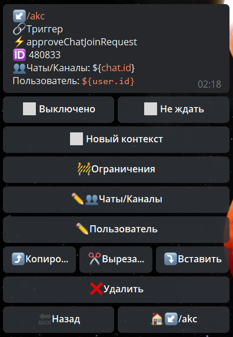

## QNext admin реакция approveChatJoinRequest

**approveChatJoinRequest** - одобрить запрос в чат.

Чаты/Каналы - указываем в каком чате необходимо одобрить заявку пользователя

Пользователь - указываем ID юзера, чью заявку необходимо одобрить.

[QNext. Чаты](/docs-test/ph/admin/chat-about)

[QNext. Перечень реакции](/docs-test/ph/reactions)

  
[Original](https://telegra.ph/QNext-admin-reaction-approveChatJoinRequest-01-05)