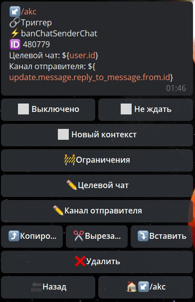

## QNext реакция banChatSenderChat

**banChatSenderChat** - заблокировать канал в чате.

Целевой чат - путь в котором будет указан id чата где надо заблокировать канал

Канал отправителя - путь по которому указан ID канала

[QNext. Чаты](/docs-test/ph/admin/chat-about)

[QNext. Перечень реакции](/docs-test/ph/reactions)

  
[Original](https://telegra.ph/QNext-admin-reaction-banChatSenderChat-01-05)