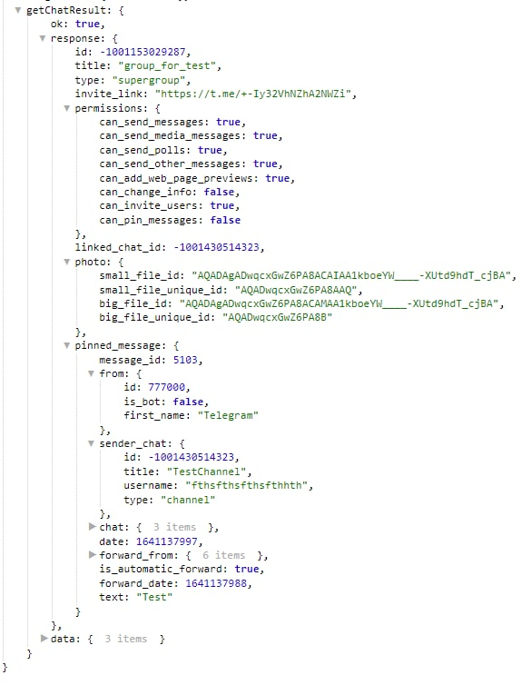

## QNext реакция getChat

**getChat** - получить информацию о чате. 

Чаты/Каналы - указываем чат в котором необходимо выполнить действие

Информация о чате будет доступна в переменной:
_${getChatResult}_

::: tip
[**getChat method bot.api** ](https://core.telegram.org/bots/api#getchat)
:::

[QNext. Перечень реакции](/docs-test/ph/reactions)

[QNext. Документация](/docs-test/ph)

[Original](https://telegra.ph/QNext-admin-reaction-getChat-01-06)