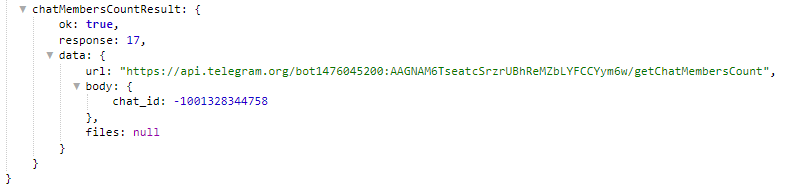

## QNext реакция getChatMemberCount

**getChatMemberCount** -получить количество участников в чате.

Чаты/Каналы - указываем чат в котором необходимо получить информацию.

Информация доступна в переменной: 
_${chatMembersCountResult}_

::: tip
[**getChatMemberCount method bot.api**](https://core.telegram.org/bots/api#getchatmember)
:::

[QNext. Чаты](/docs-test/ph/admin/chat-about)

[QNext. Перечень реакции](/docs-test/ph/reactions)

  
[Original](https://telegra.ph/QNext-admin-reaction-getChatMemberCount-01-06)