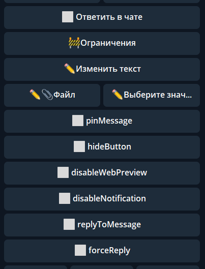

## QNext. реакция sendMessage

**sendMessage** — реакция отправит текстовое сообщение. Сообщение отправляется в приват с ботом, если реакция не вложена в take-реакцию, которая указывает направление вывода.

Например:

sendMessage — сообщение в личку с ботом

takeChat — выбрать чат

— sendMessage — сообщение в выбранный чат

При создании реакции можно добавить файл. Если в качестве файла использовать изображение, то оно будет размещено над текстом. В качестве файла можно использовать стикер, но в этом случае текст сообщения будет скрыт (недоступен).

В настройках реакции доступны следующие функции:

* **Файл / Выбрать значение**** - позволяет отправлять медиа
* **Ответить в чате** - при включении, направление вывода сообщения может измениться с бота на чат, если реакция будет выполняться в чате.
* **pinMessage** - закрепляет отправленное сообщение, аналогична реакции pin.
* **hideButton** - добавит к сообщению кнопку скрыть пост. Кнопка будет доступна на протяжении 48 часов.
* **disableWebPreview** - отключит предпросмотр ссылок содержащихся в сообщении.
* **disableNotification** - отключит оповещение о новом сообщении.
* **replyToMessage** - создает ответ на сообщение.
* **forceReply** - подготовит ответ на сообщение.

** появилась возможность указать путь до файла, который необходимо отправить.

Можно указать путь до message где лежит любой файл, например чтобы переслать файл на который сделали reply, укажите следующий путь:

_${update.message.reply_to_message}_

или _${update.message}_ - если нужно отловить просто отправленное медиа

А можно указать путь до объекта который хранит в себе параметры fileId и type. Поле type должно иметь одно из значений:

🔸photo

🔸audio

🔸video

🔸video_note

🔸animation

🔸document

🔸voice

🔸sticker

по умолчанию реакция возьмет фото с максимальным размеров, если тебе например надо взять другой размер, тогда нужно создать в локальных переменных объект который содержит fileId и type = photo

**Как это сделать?**

1) localVarSet file.fileId = ${путь до file_id} **Галочка Собрать объект**

2) localVarSet file.type = photo **Галочка Собрать объект**

а потом указываешь путь:

${localVar.file}

Реакция может показывать файлы, полученные в процессе выполнения реакции, с помощью макроса: !{attach| path: Путь}, где Путь - это местоположение файла.

Например: после реакции exportToExcel, файл будет доступен в переменной: ${exports.votes} иkb ${exports.form} (для голосований или формы соответственно). Чтобы прислать экспортированный файл, можно воспользоваться реакцией sendMessage с текстом: !{attach| path: exports.votes} или !{attach| path: exports.form}

**Особенности:**

Можно одновременно отправить медиа + текст.

Нельзя отправить одновременно стикер + текст.

Лимит количества символов в сообщении - 4096 символов.

Лимит количества символов в подписи к медиа (медиа + текст) - 1024 символа.

[QNext. Перечень реакций](/docs-test/ph/reactions)

[Original](https://telegra.ph/QNext-admin-reaction-message-05-09)