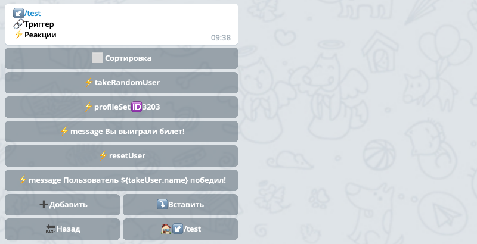
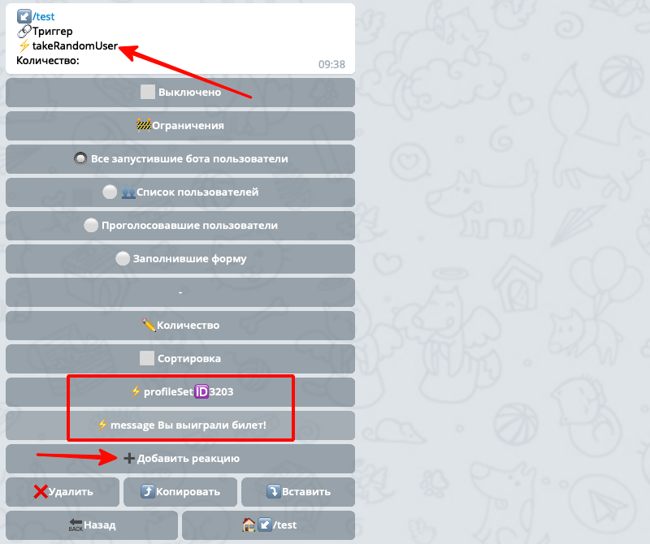
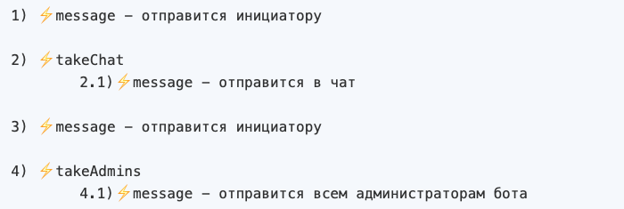
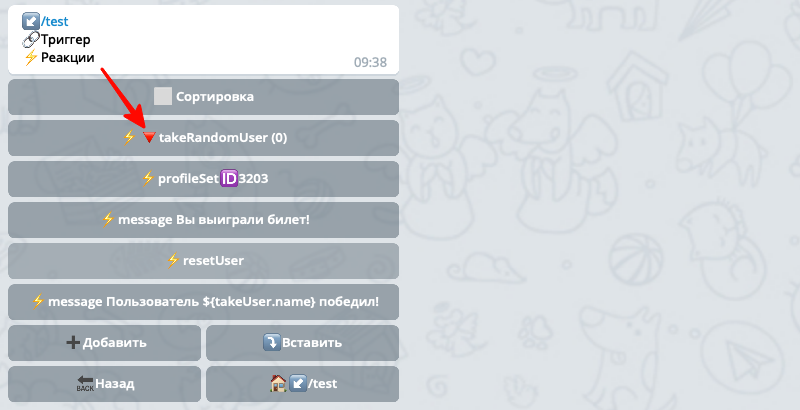
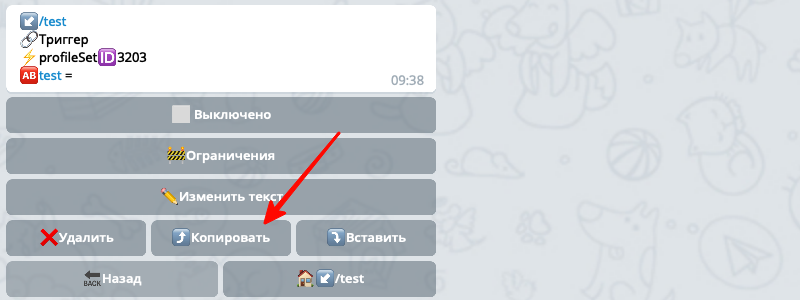
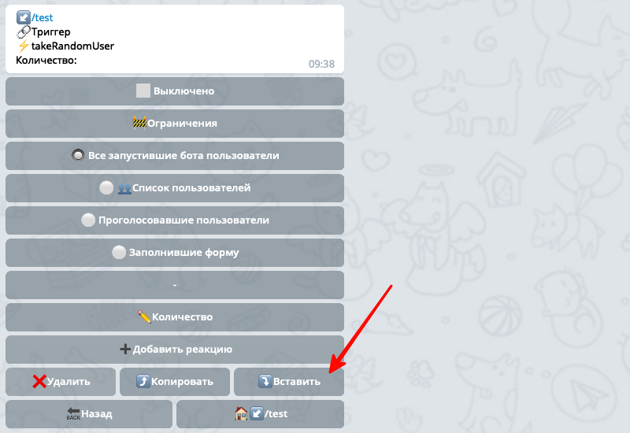
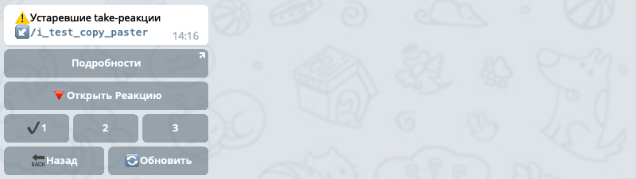

## Новый механизм take-реакций
* [Что такое take-реакции?](#что-такое-take-реакции?)
     * [Рассмотрим пример](#рассмотрим-пример)
     * [Как это работало раньше?](#как-это-работало-раньше?)
     * [Что не так с этим механизмом?](#что-не-так-с-этим-механизмом?)
* [Так что там с новым механизмом?](#так-что-там-с-новым-механизмом?)
     * [Куда делась реакция resetUser?](#куда-делась-реакция-resetuser?)
* [Что мне делать в итоге?](#что-мне-делать-в-итоге?)
* [Как мне быстро найти все реакции требующие обновления?](#как-мне-быстро-наити-все-реакции-требующие-обновления?)
* [Какие реакции надо изменить?](#какие-реакции-надо-изменить?)
* [Список переименованных реакций](#список-переименованных-реакции)
* [Я ничего не понял](#я-ничего-не-понял)
### Что такое take-реакции?

**take-реакции** - это целый класс реакций, которые изменяют направление работы бота, т.е. это реакции которые указывают боту с каким пользователем или чатом работать в последующих реакциях. Когда бот меняет направление, будем говорить что бот поменял **цель реакций**.
### Рассмотрим пример
* необходимо взять случайного пользователя
* добавить ему в профиль некий параметр
* написать этому юзеру что то в личку
* написать что все выполнено человеку, инициировавшему это действие 
### Как это работало раньше?


* Реакция ⚡️takeRandomUser берет из базы случайного пользователя и сообщает боту что последующие реакции необходимо выполнять с этим пользователем, которого мы получили в takeRandom. **Т.е. меняем цель реакций**.
* Далее бот выполняет две реакции с указанной целью(случайный юзер): записывает в профиль, и отправляет ему в личку сообщение.
* После чего нам необходимо в личку инициатора этого действия отправить сообщение о том кто же победил. Т.е. нам необходимо восстановить изначальную цель. Для этого мы указываем реакцию ⚡️resetUser, чтобы сообщить боту, что необходимо восстановить юзера по умолчанию, т.е. того юзера который инициировал этот триггер.
* После этого реакция ⚡️message отправит сообщение в личку инициатору этого действия.
### Что не так с этим механизмом?

Когда реакций становится много, цели постоянно меняются(например пишем юзеру, потом пишем в чат/канал, возвращаемся к админу ему что то пишем и т.д.) - управлять всем этим механизмом становится сложно. А если еще надо добавить в середину новую реакцию, приходится применять сортировку и думать куда же вставить и не ошибиться. В общем решение оказалось не удачным, будем исправлять.


### Так что там с новым механизмом?

С новым механизмом **take-реакций**, все те реакции которые вы хотите применить к новому пользователю или чату необходимо создавать внутри take-реакции. Т.е. все take-реакции сейчас работают так же как и реакция группировки **⚡️groupReaction**.

Т.е. мы создаем реакцию **⚡️**takeRandomUser, заходим внутрь этой реакции и там создаем еще две реакции profileSet и message. Эти две реакции будут применены к случайной цели, выбранной родительской реакцией. Вот как это будет выглядеть в боте:


Т.е. у нас здесь всего две реакции **⚡️**takeRandomUser и **⚡️**message. Обратите внимание на takeRandomUser, справа в скобках цифра два, это значит что внутри этой реакции есть еще две реакции. Если зайти внутрь, можно увидеть наши предыдущие реакции **⚡️**profileSet и **⚡️**message юзеру в личку:



Как видите здесь есть кнопка `➕Добавить реакцию`. Все реакции которые вы создадите внутри этой take-реакции будут применены к цели, которую выбрала take-реакция, в данном случае это случайный пользователь.
### Куда делась реакция resetUser?

Рассмотрим еще простой пример:



Как видите реакция ⚡️resetUser потеряла актуальность, создать её больше нельзя, потому что все реакции вне take-группировки по умолчанию применяются к инициатору триггера.
### Что мне делать в итоге?

Старые реакции для обратной совместимости какое то время будут работать как и прежде. Это продлится 2-3 месяца.  Те реакции, которые работаю по старому механизму, и требуют переделки помечены специальным символом 🔻:



Необходимо все такие реакции изменить согласно новым правилам, т.е. перенести реакции между take и resetUser внутрь take-реакции.

Для упрощения этого процесса, у реакций появился механизм копирования/вставки. Вы можете "скопировать" нужную реакцию:



И "вставить" внутрь take-реакции, при этом будет создана полная копия исходной реакции:


### Как мне быстро найти все реакции требующие обновления?

Откройте раздел `⚙️ Настройки бота -> 🔗Триггеры -> ⚡️Реакции -> ⚠️Устаревшие take-реакции`:



Здесь вы сможете увидеть все реакции требующие замены. Нажмите на кнопку `🔻Открыть Реакцию` для быстрого перехода в триггер, где находится эта реакция.
### Какие реакции надо изменить?

Вот список take-реакций, которые теперь работаю по новым правилам:
```js 
⚡️for
⚡️takeAdmins
⚡️takeAuthorUser
⚡️takeButtonsUser
⚡️takeChat
⚡️takeChatAdmins
⚡️takeChatDir
⚡️takeMentions
⚡️takePollUsers
⚡️takeRandomUser
⚡️takeReplyUser
⚡️takeTechChat
⚡️takeUser
⚡️takeUserList
⚡️takeVariable

```


### Список переименованных реакций

Следующие реакции назывались take, но они не меняют цель реакций, и по сути не являются take-реакциями. А т.к. у нас take - это теперь отдельный специальный класс реакций, чтобы не путаться, было принято решение их переименовать:
```js 
⚡️takeButton➡️loadButton
⚡️takeContent➡️loadContent
⚡️takeRandomContent➡️loadRandomContent
⚡️takeVoteResults➡️loadVoteResults
⚡️takeVote➡️loadVote
⚡️takeProfile➡️loadProfile

```

Делать с ними ничего не нужно, они работают как и прежде, просто имейте ввиду что они были переименованы. 


### Я ничего не понял

Приходите в чат тех поддержки [@ZBots](https://t.me/ZBots), попробуем вместе разобраться :)


[QNext. Документация](/docs-test/ph)


  
[Original](https://telegra.ph/Novyj-mehanizm-take-reakcij-12-13)