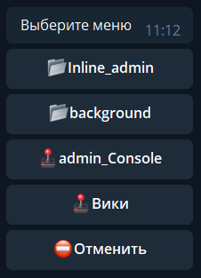
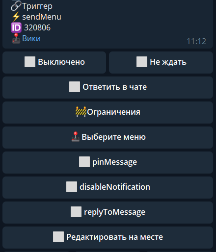

## QNext. реакция sendMenu

**sendMenu** - показать пользователю меню. Вы можете выбрать какой из подпунктов меню открыть при срабатывании реакции.

**pinMessage** - закрепить отправленное меню в чате.

**disableNotification** - отключает уведомление об отправке сообщения

**replyTomessage** - отправить реплаем (ответом) на команду.

**Редактировать на месте** - изменить меню без удаления и повторной отправки (гладкое редактирование меню)

[QNext. Перечень реакции](/docs-test/ph/reactions)
  
[Original](https://telegra.ph/QNext-admin-reaction-sendMenu-05-09)