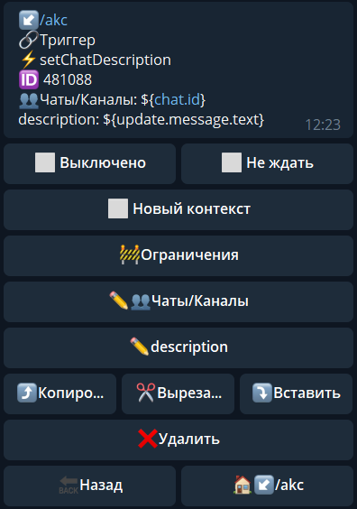

## QNext реакция setChatDescription

**setChatDescription** - изменить описание чата

Чаты/Каналы - указываем чат в котором необходимо выполнить действие

title - текст, на который необходимо изменить описание

**ОСОБЕННОСТИ**:

Максимум 255 символов.

::: tip
[**setChatDescription method bot.api**](https://core.telegram.org/bots/api#setchatdescription)
:::

[QNext. Чаты](/docs-test/ph/admin/chat-about)

[QNext. Перечень реакции](/docs-test/ph/reactions)

[Original](https://telegra.ph/QNext-admin-reaction-setChatDescription-01-06)