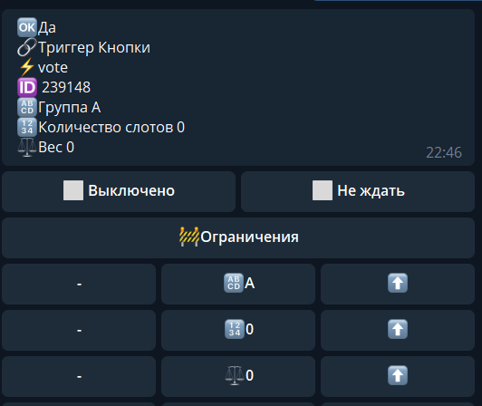

## QNext. реакция vote

**vote** - Провести голосование.

**🔠 Группа** - если Вы хотите дать респондентам возможность проголосовать за разные варианты - на ⚡️реакциях [vote] этих кнопок должно быть разное порядковое значение:

Кнопка 1 - ⚡️vote A

Кнопка 2 - ⚡️vote B

**🔢Количество слотов -** Это количество возможных голосов за эту кнопку. После того как количество голосов станет равным количеству слотов, голосовать за эту кнопку станет невозможно.

⚖️Вес голоса

____________________________

В реакции ⚡️vote можно задать ⚖️Вес голоса. А после посчитать общий вес с помощью макроса

У кнопок заданы веса 1, 2 и 3 соответственно. Внизу отображается общий вес и сумма весов каждой кнопки.

Общий вес ⚖️: 

Вес кнопки 1️⃣: 

Вес кнопки 2️⃣: 

Вес кнопки 3️⃣:

[QNext. Голосование](/docs-test/ph/admin/vote-about)

[QNext. Перечень реакции](/docs-test/ph/reactions)

[Original](https://telegra.ph/QNext-admin-reaction-vote-04-28)