## QNext Подключение бота

В этой статье разберем вопросы подключения бота к @Qnextbot, а так же обновление токена в уже подключенном боте. 

Разберем эти вопросы в 2 этапа:
### Оглавление

[**Получение токена**](#получение-токена)
* [Создание нового бота](#создание-нового-бота)
* [Получение токена для имеющегося бота](#получение-токена-для-имеющегося-бота)

[**Регистрация бота в @Qnextbot**](#регистрация-бота)
* [Подключение бота в @Qnextbot](#первое-подключение-бота)
* [Обновление имеющегося токена](#обновление-токена)

### Получение токена
### Создание нового бота

Необходимо открыть Telegram, найти системного бота @BotFather и начать с ним диалог;

@BotFather — это официальный Telegram бот, который создает и регистрирует другие боты в мессенджере.

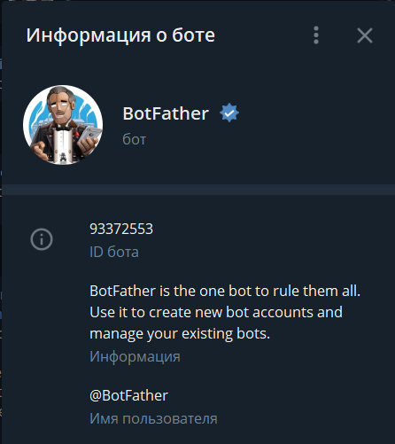

Вводим команду: /newbots

Здесь вам необходимо придумать имя вашему боту.

Следующий шаг самый важный - придумать юзернейм боту.

Здесь вам необходимо придумать юзернейм вашему будущему боту. Формат юзернейма: @Название+bot

Поздравляем, бот зарегистрирован! 

Для привязки вашего бота к сервису [Qnextbot](http://t.me/Qnextbot) будет необходимо ввести API ключ в соответствующее окно в личном кабинете.

**API ключ — секретный код, который позволяет настроить связь с ботом вне клиента Telegram.**

Вот это наш токен: **2123604297:AAElPpyxzy5C1TdmDHxCnFasQF6N9Jta-RQ**

Копируем полученный токен, и переходим к 3 этапу: 

[Подключение бота в @Qnextbot](#первое-подключение-бота)
::: tip
[**Вернуться к Оглавлению**](#оглавление)
:::

### Получение токена для имеющегося бота

Заходим в бота: **@BotFather**

Вводим команду: **/mybots**

Находим нашего бота, чей токен нужно обновить, и нажимаем на кнопку юзернеймом вашего бота. 

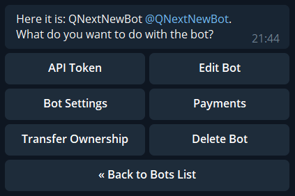

Здесь нас интересует кнопка: **API Token**, нажимаем, заходим в раздел.

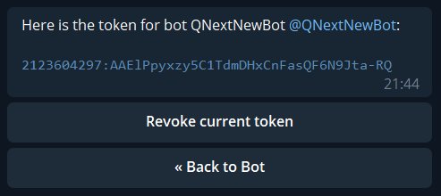

Нажимаем на кнопку: **Revoke current token**

Получаем новый токен, его нам необходимо скопировать. 

После копирования токена, переходим 3 этапу: 

[Обновление имеющегося токена](#обновление-токена)
::: tip
[**Вернуться к Оглавлению**](#оглавление)
:::

### Регистрация бота

Находим  главного бота для подключения вашего бота к сервису: [@Qnextbot](http://t.me/Qnexbot)

Запускаем бота, выбираем язык

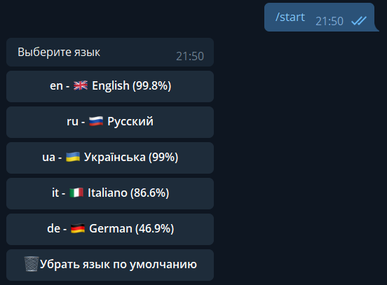

Если вы первый раз в проекте, рекомендую изучить обучение. Если вы уже ранее регистрировали ботов, обучение можно пропустить.

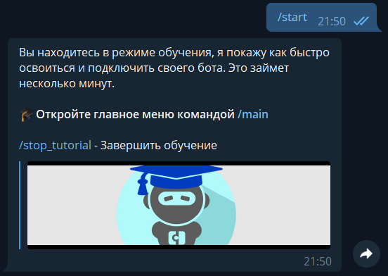

После прохождения обучения, нам открывается главное меню бота:

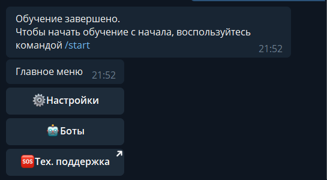

Нам нужна кнопка "Боты" - заходим туда

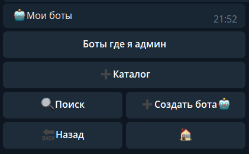
::: tip
[**Вернуться к Оглавлению**](#оглавление)
:::

### Первое подключение бота

- нажимаем на кнопку **"Создать бота"**

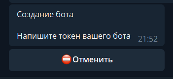

И вот здесь нам нужен ранее скопированный токен, вставляем токен

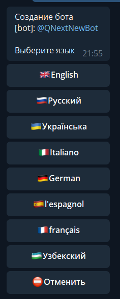

далее выбираем язык бота. На этом языке будут все тексты в боте по умолчанию.

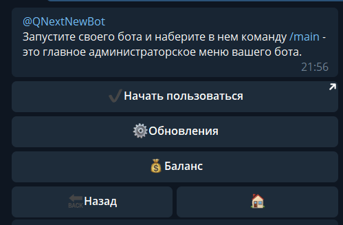

Готово! Можно начинать работать!
::: tip
[**Вернуться к Оглавлению**](#оглавление)
:::

### Обновление токена

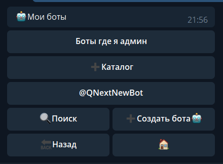

Выбираем нужного бота

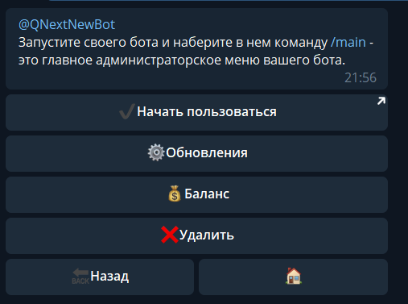

Здесь нам потребуется кнопка "**Обновления**"

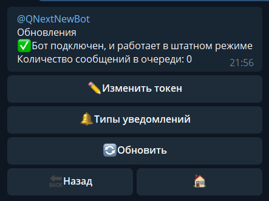

Видим кнопку "**Изменить токен**"

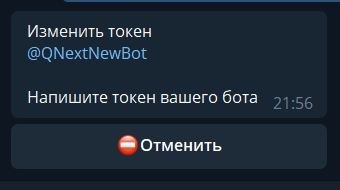

Вводим ранее скопированный токен

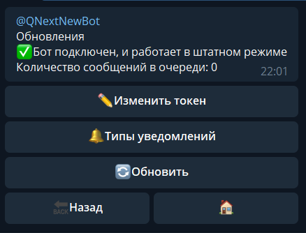

Готово! Вы молодцы!
::: tip
[**Вернуться к Оглавлению**](#оглавление)
:::

[QNext. Документация](/docs-test/ph)
  
[Original](https://telegra.ph/QNext-transfer-token-about-11-21)