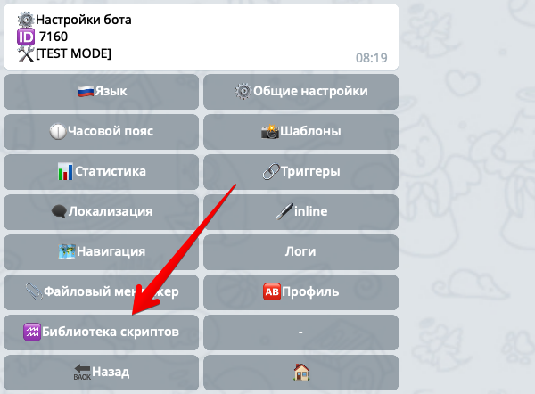

## QNext. Библиотека скриптов

[⬅️QNext. Скрипты](/docs-test/ph/script)

♒️Библиотеки скриптов могу быть полезны в тех случаях, когда вам необходимо один и тот же кусок кода использовать в разных реакциях ⚡️`runScript`. Чтобы не дублировать один и тот же код в разных местах, вы можете создать ♒️Библиотеку скриптов, которая по сути является обычным javascript кодом. После создания библиотеки, вы можете использовать код написанный в ней в других ваших скриптах.

Откройте раздел ⚙️Настройки бота - ♒️ Библиотека скриптов:

И нажмите кнопку Создать♒️, чтобы создать новую библиотеку:
* На первом шаге бот попросит указать название библиотеки. Указывать можно название состоящее только из символов английского языка, цифр и символа "_", при этом название не может начинаться с цифры. Напишите название, например **weekDaysLib**.
* На втором шаге напишите javascript-код вашей библиотеки, а затем в конце укажите какие функции и переменные вы хотите экспортировать, записав  их в объект `module.exports`. Например так:
::: tip
const short = ['Вс', 'Пн', 'Вт', 'Ср', 'Чт', 'Пт', 'Сб']; function getShort(dayNum) {  return short[dayNum]; }  const normal = [  'Воскресенье',  'Понедельник',  'Вторник',  'Среда',  'Четверг',  'Пятница',  'Суббота' ]; function getNormal(dayNum) {  return normal[dayNum]; }  function testLib(num) {   console.log("test", num); }  module.exports = {  short: getShort,  normal: getNormal, } 
:::

Эта функция возвращает сокращенное и обычные названия дней недели по их номеру. Обратите внимание, после импорта этой библиотеки, вы сможете вызывать только те функции, которые вы записали в объект `module.exports`, например функция `testLib` не экспортирована и следовательно вы не сможете её использовать в других скриптах.

Чтобы воспользоваться этой библиотекой функций, вы можете в реакции ⚡️`runScript` указать следующий код:
::: tip
// импортируем нашу библиотеку с именем weekDaysLib var weekDays = require("weekDaysLib");  var date = new Date(); var dayNum = date.getDay(); // вызываем функцию из нашей библиотеки var name = weekDays.normal(dayNum); console.log("Текущий день недели: "+name) 
:::

Во второй строчке мы импортируем нашу библиотеку воспользовавшись функцией  `require(...)`, и указав этой функции название нашей библиотеки `"weekDaysLib"`. 

[⬅️QNext. Скрипты](/docs-test/ph/script)
  
[Original](https://telegra.ph/QNext-Scripts-Library-05-08)