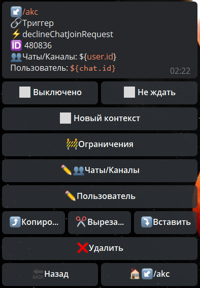

## QNext реакция declineChatJoinRequest

**declineChatJoinRequest** - отклонить запрос в чат.

Чаты/Каналы - указываем в каком чате необходимо отклонить заявку пользователя

Пользователь - указываем ID юзера, чью заявку необходимо отклонить.

