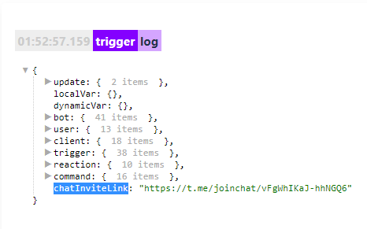

## QNext. реакция exportChatInviteLink

exportChatInviteLink - Позволяет боту создать свою ссылку в чат.

Переменная для указания ссылки: ${chatInviteLink}

В логах реакция выглядит так: 

[QNext. Чаты](/docs-test/admin/chat-about)

[QNext. Перечень реакции](/docs-test/reactions)

  
[Original](https://telegra.ph/QNext-admin-reaction-exportChatInviteLink-04-26)